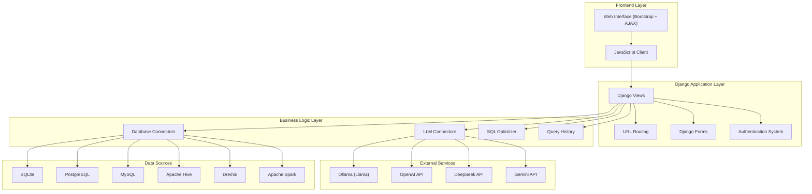

I'll create a comprehensive architecture diagram for the GenAI Query Analyzer project using Mermaid diagrams.

```markdown
# GenAI Query Analyzer - Project Architecture

## 1. High-Level System Architecture



## 2. Django Application Structure

```mermaid
Diagram.download-icon {
            cursor: pointer;
            transform-origin: center;
        }
        .download-icon .arrow-part {
            transition: transform 0.35s cubic-bezier(0.35, 0.2, 0.14, 0.95);
             transform-origin: center;
        }
        button:has(.download-icon):hover .download-icon .arrow-part, button:has(.download-icon):focus-visible .download-icon .arrow-part {
          transform: translateY(-1.5px);
        }
        #mermaid-diagram-r20m{font-family:var(--font-geist-sans);font-size:12px;fill:#000000;}#mermaid-diagram-r20m .error-icon{fill:#552222;}#mermaid-diagram-r20m .error-text{fill:#552222;stroke:#552222;}#mermaid-diagram-r20m .edge-thickness-normal{stroke-width:1px;}#mermaid-diagram-r20m .edge-thickness-thick{stroke-width:3.5px;}#mermaid-diagram-r20m .edge-pattern-solid{stroke-dasharray:0;}#mermaid-diagram-r20m .edge-thickness-invisible{stroke-width:0;fill:none;}#mermaid-diagram-r20m .edge-pattern-dashed{stroke-dasharray:3;}#mermaid-diagram-r20m .edge-pattern-dotted{stroke-dasharray:2;}#mermaid-diagram-r20m .marker{fill:#666;stroke:#666;}#mermaid-diagram-r20m .marker.cross{stroke:#666;}#mermaid-diagram-r20m svg{font-family:var(--font-geist-sans);font-size:12px;}#mermaid-diagram-r20m p{margin:0;}#mermaid-diagram-r20m .label{font-family:var(--font-geist-sans);color:#000000;}#mermaid-diagram-r20m .cluster-label text{fill:#333;}#mermaid-diagram-r20m .cluster-label span{color:#333;}#mermaid-diagram-r20m .cluster-label span p{background-color:transparent;}#mermaid-diagram-r20m .label text,#mermaid-diagram-r20m span{fill:#000000;color:#000000;}#mermaid-diagram-r20m .node rect,#mermaid-diagram-r20m .node circle,#mermaid-diagram-r20m .node ellipse,#mermaid-diagram-r20m .node polygon,#mermaid-diagram-r20m .node path{fill:#eee;stroke:#999;stroke-width:1px;}#mermaid-diagram-r20m .rough-node .label text,#mermaid-diagram-r20m .node .label text{text-anchor:middle;}#mermaid-diagram-r20m .node .katex path{fill:#000;stroke:#000;stroke-width:1px;}#mermaid-diagram-r20m .node .label{text-align:center;}#mermaid-diagram-r20m .node.clickable{cursor:pointer;}#mermaid-diagram-r20m .arrowheadPath{fill:#333333;}#mermaid-diagram-r20m .edgePath .path{stroke:#666;stroke-width:2.0px;}#mermaid-diagram-r20m .flowchart-link{stroke:#666;fill:none;}#mermaid-diagram-r20m .edgeLabel{background-color:white;text-align:center;}#mermaid-diagram-r20m .edgeLabel p{background-color:white;}#mermaid-diagram-r20m .edgeLabel rect{opacity:0.5;background-color:white;fill:white;}#mermaid-diagram-r20m .labelBkg{background-color:rgba(255, 255, 255, 0.5);}#mermaid-diagram-r20m .cluster rect{fill:hsl(0, 0%, 98.9215686275%);stroke:#707070;stroke-width:1px;}#mermaid-diagram-r20m .cluster text{fill:#333;}#mermaid-diagram-r20m .cluster span{color:#333;}#mermaid-diagram-r20m div.mermaidTooltip{position:absolute;text-align:center;max-width:200px;padding:2px;font-family:var(--font-geist-sans);font-size:12px;background:hsl(-160, 0%, 93.3333333333%);border:1px solid #707070;border-radius:2px;pointer-events:none;z-index:100;}#mermaid-diagram-r20m .flowchartTitleText{text-anchor:middle;font-size:18px;fill:#000000;}#mermaid-diagram-r20m .flowchart-link{stroke:hsl(var(--gray-400));stroke-width:1px;}#mermaid-diagram-r20m .marker,#mermaid-diagram-r20m marker,#mermaid-diagram-r20m marker *{fill:hsl(var(--gray-400))!important;stroke:hsl(var(--gray-400))!important;}#mermaid-diagram-r20m .label,#mermaid-diagram-r20m text,#mermaid-diagram-r20m text>tspan{fill:hsl(var(--black))!important;color:hsl(var(--black))!important;}#mermaid-diagram-r20m .background,#mermaid-diagram-r20m rect.relationshipLabelBox{fill:hsl(var(--white))!important;}#mermaid-diagram-r20m .entityBox,#mermaid-diagram-r20m .attributeBoxEven{fill:hsl(var(--gray-150))!important;}#mermaid-diagram-r20m .attributeBoxOdd{fill:hsl(var(--white))!important;}#mermaid-diagram-r20m .label-container,#mermaid-diagram-r20m rect.actor{fill:hsl(var(--white))!important;stroke:hsl(var(--gray-400))!important;}#mermaid-diagram-r20m line{stroke:hsl(var(--gray-400))!important;}#mermaid-diagram-r20m :root{--mermaid-font-family:var(--font-geist-sans);}Static FilesUtils PackageTemplatesquery_analyzer (Django App)genai_project (Main Project)settings.pyurls.pywsgi.pyasgi.pymodels.pyviews.pyurls.pyforms.pyadmin.pyapps.pybase.htmlhome.htmlsignup.htmlsignin.htmlllm_connector.pydb_connector.pysql_optimizer.pystyles.cssmain.js
```

## 3. Data Flow Architecture

```mermaid
Diagram.download-icon {
            cursor: pointer;
            transform-origin: center;
        }
        .download-icon .arrow-part {
            transition: transform 0.35s cubic-bezier(0.35, 0.2, 0.14, 0.95);
             transform-origin: center;
        }
        button:has(.download-icon):hover .download-icon .arrow-part, button:has(.download-icon):focus-visible .download-icon .arrow-part {
          transform: translateY(-1.5px);
        }
        DatabaseLLMDjangoFrontendUserDatabaseLLMDjangoFrontendUser#mermaid-diagram-r20r{font-family:var(--font-geist-sans);font-size:12px;fill:#000000;}#mermaid-diagram-r20r .error-icon{fill:#552222;}#mermaid-diagram-r20r .error-text{fill:#552222;stroke:#552222;}#mermaid-diagram-r20r .edge-thickness-normal{stroke-width:1px;}#mermaid-diagram-r20r .edge-thickness-thick{stroke-width:3.5px;}#mermaid-diagram-r20r .edge-pattern-solid{stroke-dasharray:0;}#mermaid-diagram-r20r .edge-thickness-invisible{stroke-width:0;fill:none;}#mermaid-diagram-r20r .edge-pattern-dashed{stroke-dasharray:3;}#mermaid-diagram-r20r .edge-pattern-dotted{stroke-dasharray:2;}#mermaid-diagram-r20r .marker{fill:#666;stroke:#666;}#mermaid-diagram-r20r .marker.cross{stroke:#666;}#mermaid-diagram-r20r svg{font-family:var(--font-geist-sans);font-size:12px;}#mermaid-diagram-r20r p{margin:0;}#mermaid-diagram-r20r .actor{stroke:hsl(0, 0%, 83%);fill:#eee;}#mermaid-diagram-r20r text.actor>tspan{fill:#333;stroke:none;}#mermaid-diagram-r20r .actor-line{stroke:hsl(0, 0%, 83%);}#mermaid-diagram-r20r .messageLine0{stroke-width:1.5;stroke-dasharray:none;stroke:#333;}#mermaid-diagram-r20r .messageLine1{stroke-width:1.5;stroke-dasharray:2,2;stroke:#333;}#mermaid-diagram-r20r #arrowhead path{fill:#333;stroke:#333;}#mermaid-diagram-r20r .sequenceNumber{fill:white;}#mermaid-diagram-r20r #sequencenumber{fill:#333;}#mermaid-diagram-r20r #crosshead path{fill:#333;stroke:#333;}#mermaid-diagram-r20r .messageText{fill:#333;stroke:none;}#mermaid-diagram-r20r .labelBox{stroke:hsl(0, 0%, 83%);fill:#eee;}#mermaid-diagram-r20r .labelText,#mermaid-diagram-r20r .labelText>tspan{fill:#333;stroke:none;}#mermaid-diagram-r20r .loopText,#mermaid-diagram-r20r .loopText>tspan{fill:#333;stroke:none;}#mermaid-diagram-r20r .loopLine{stroke-width:2px;stroke-dasharray:2,2;stroke:hsl(0, 0%, 83%);fill:hsl(0, 0%, 83%);}#mermaid-diagram-r20r .note{stroke:#999;fill:#666;}#mermaid-diagram-r20r .noteText,#mermaid-diagram-r20r .noteText>tspan{fill:#fff;stroke:none;}#mermaid-diagram-r20r .activation0{fill:#f4f4f4;stroke:#666;}#mermaid-diagram-r20r .activation1{fill:#f4f4f4;stroke:#666;}#mermaid-diagram-r20r .activation2{fill:#f4f4f4;stroke:#666;}#mermaid-diagram-r20r .actorPopupMenu{position:absolute;}#mermaid-diagram-r20r .actorPopupMenuPanel{position:absolute;fill:#eee;box-shadow:0px 8px 16px 0px rgba(0,0,0,0.2);filter:drop-shadow(3px 5px 2px rgb(0 0 0 / 0.4));}#mermaid-diagram-r20r .actor-man line{stroke:hsl(0, 0%, 83%);fill:#eee;}#mermaid-diagram-r20r .actor-man circle,#mermaid-diagram-r20r line{stroke:hsl(0, 0%, 83%);fill:#eee;stroke-width:2px;}#mermaid-diagram-r20r .flowchart-link{stroke:hsl(var(--gray-400));stroke-width:1px;}#mermaid-diagram-r20r .marker,#mermaid-diagram-r20r marker,#mermaid-diagram-r20r marker *{fill:hsl(var(--gray-400))!important;stroke:hsl(var(--gray-400))!important;}#mermaid-diagram-r20r .label,#mermaid-diagram-r20r text,#mermaid-diagram-r20r text>tspan{fill:hsl(var(--black))!important;color:hsl(var(--black))!important;}#mermaid-diagram-r20r .background,#mermaid-diagram-r20r rect.relationshipLabelBox{fill:hsl(var(--white))!important;}#mermaid-diagram-r20r .entityBox,#mermaid-diagram-r20r .attributeBoxEven{fill:hsl(var(--gray-150))!important;}#mermaid-diagram-r20r .attributeBoxOdd{fill:hsl(var(--white))!important;}#mermaid-diagram-r20r .label-container,#mermaid-diagram-r20r rect.actor{fill:hsl(var(--white))!important;stroke:hsl(var(--gray-400))!important;}#mermaid-diagram-r20r line{stroke:hsl(var(--gray-400))!important;}#mermaid-diagram-r20r :root{--mermaid-font-family:var(--font-geist-sans);}Enter natural language queryPOST /api/generate-sql/Send query + schemaReturn SQL queryReturn generated SQLDisplay SQLClick "Execute SQL"POST /api/execute-sql/Execute SQL queryReturn resultsReturn query resultsDisplay results (table/chart)
```

## 4. Database Schema

```mermaid
Diagram.download-icon {
            cursor: pointer;
            transform-origin: center;
        }
        .download-icon .arrow-part {
            transition: transform 0.35s cubic-bezier(0.35, 0.2, 0.14, 0.95);
             transform-origin: center;
        }
        button:has(.download-icon):hover .download-icon .arrow-part, button:has(.download-icon):focus-visible .download-icon .arrow-part {
          transform: translateY(-1.5px);
        }
        #mermaid-diagram-r213{font-family:var(--font-geist-sans);font-size:12px;fill:#000000;}#mermaid-diagram-r213 .error-icon{fill:#552222;}#mermaid-diagram-r213 .error-text{fill:#552222;stroke:#552222;}#mermaid-diagram-r213 .edge-thickness-normal{stroke-width:1px;}#mermaid-diagram-r213 .edge-thickness-thick{stroke-width:3.5px;}#mermaid-diagram-r213 .edge-pattern-solid{stroke-dasharray:0;}#mermaid-diagram-r213 .edge-thickness-invisible{stroke-width:0;fill:none;}#mermaid-diagram-r213 .edge-pattern-dashed{stroke-dasharray:3;}#mermaid-diagram-r213 .edge-pattern-dotted{stroke-dasharray:2;}#mermaid-diagram-r213 .marker{fill:#666;stroke:#666;}#mermaid-diagram-r213 .marker.cross{stroke:#666;}#mermaid-diagram-r213 svg{font-family:var(--font-geist-sans);font-size:12px;}#mermaid-diagram-r213 p{margin:0;}#mermaid-diagram-r213 .entityBox{fill:#eee;stroke:#999;}#mermaid-diagram-r213 .attributeBoxOdd{fill:#ffffff;stroke:#999;}#mermaid-diagram-r213 .attributeBoxEven{fill:#f2f2f2;stroke:#999;}#mermaid-diagram-r213 .relationshipLabelBox{fill:hsl(-160, 0%, 93.3333333333%);opacity:0.7;background-color:hsl(-160, 0%, 93.3333333333%);}#mermaid-diagram-r213 .relationshipLabelBox rect{opacity:0.5;}#mermaid-diagram-r213 .relationshipLine{stroke:#666;}#mermaid-diagram-r213 .entityTitleText{text-anchor:middle;font-size:18px;fill:#000000;}#mermaid-diagram-r213 #MD_PARENT_START{fill:#f5f5f5!important;stroke:#666!important;stroke-width:1;}#mermaid-diagram-r213 #MD_PARENT_END{fill:#f5f5f5!important;stroke:#666!important;stroke-width:1;}#mermaid-diagram-r213 .flowchart-link{stroke:hsl(var(--gray-400));stroke-width:1px;}#mermaid-diagram-r213 .marker,#mermaid-diagram-r213 marker,#mermaid-diagram-r213 marker *{fill:hsl(var(--gray-400))!important;stroke:hsl(var(--gray-400))!important;}#mermaid-diagram-r213 .label,#mermaid-diagram-r213 text,#mermaid-diagram-r213 text>tspan{fill:hsl(var(--black))!important;color:hsl(var(--black))!important;}#mermaid-diagram-r213 .background,#mermaid-diagram-r213 rect.relationshipLabelBox{fill:hsl(var(--white))!important;}#mermaid-diagram-r213 .entityBox,#mermaid-diagram-r213 .attributeBoxEven{fill:hsl(var(--gray-150))!important;}#mermaid-diagram-r213 .attributeBoxOdd{fill:hsl(var(--white))!important;}#mermaid-diagram-r213 .label-container,#mermaid-diagram-r213 rect.actor{fill:hsl(var(--white))!important;stroke:hsl(var(--gray-400))!important;}#mermaid-diagram-r213 line{stroke:hsl(var(--gray-400))!important;}#mermaid-diagram-r213 :root{--mermaid-font-family:var(--font-geist-sans);}CustomUserintidPKstringemailUKstringpasswordbooleanis_staffbooleanis_activedatetimedate_joineddatetimelast_loginQueryHistoryintidPKintuser_idFKtextnatural_querytextgenerated_sqltextoptimized_sqlstringllm_modelstringdata_sourcestringdatabase_nametexttablesdatetimecreated_athas many
```

## 5. LLM Integration Architecture

```mermaid
Diagram.download-icon {
            cursor: pointer;
            transform-origin: center;
        }
        .download-icon .arrow-part {
            transition: transform 0.35s cubic-bezier(0.35, 0.2, 0.14, 0.95);
             transform-origin: center;
        }
        button:has(.download-icon):hover .download-icon .arrow-part, button:has(.download-icon):focus-visible .download-icon .arrow-part {
          transform: translateY(-1.5px);
        }
        #mermaid-diagram-r21b{font-family:var(--font-geist-sans);font-size:12px;fill:#000000;}#mermaid-diagram-r21b .error-icon{fill:#552222;}#mermaid-diagram-r21b .error-text{fill:#552222;stroke:#552222;}#mermaid-diagram-r21b .edge-thickness-normal{stroke-width:1px;}#mermaid-diagram-r21b .edge-thickness-thick{stroke-width:3.5px;}#mermaid-diagram-r21b .edge-pattern-solid{stroke-dasharray:0;}#mermaid-diagram-r21b .edge-thickness-invisible{stroke-width:0;fill:none;}#mermaid-diagram-r21b .edge-pattern-dashed{stroke-dasharray:3;}#mermaid-diagram-r21b .edge-pattern-dotted{stroke-dasharray:2;}#mermaid-diagram-r21b .marker{fill:#666;stroke:#666;}#mermaid-diagram-r21b .marker.cross{stroke:#666;}#mermaid-diagram-r21b svg{font-family:var(--font-geist-sans);font-size:12px;}#mermaid-diagram-r21b p{margin:0;}#mermaid-diagram-r21b .label{font-family:var(--font-geist-sans);color:#000000;}#mermaid-diagram-r21b .cluster-label text{fill:#333;}#mermaid-diagram-r21b .cluster-label span{color:#333;}#mermaid-diagram-r21b .cluster-label span p{background-color:transparent;}#mermaid-diagram-r21b .label text,#mermaid-diagram-r21b span{fill:#000000;color:#000000;}#mermaid-diagram-r21b .node rect,#mermaid-diagram-r21b .node circle,#mermaid-diagram-r21b .node ellipse,#mermaid-diagram-r21b .node polygon,#mermaid-diagram-r21b .node path{fill:#eee;stroke:#999;stroke-width:1px;}#mermaid-diagram-r21b .rough-node .label text,#mermaid-diagram-r21b .node .label text{text-anchor:middle;}#mermaid-diagram-r21b .node .katex path{fill:#000;stroke:#000;stroke-width:1px;}#mermaid-diagram-r21b .node .label{text-align:center;}#mermaid-diagram-r21b .node.clickable{cursor:pointer;}#mermaid-diagram-r21b .arrowheadPath{fill:#333333;}#mermaid-diagram-r21b .edgePath .path{stroke:#666;stroke-width:2.0px;}#mermaid-diagram-r21b .flowchart-link{stroke:#666;fill:none;}#mermaid-diagram-r21b .edgeLabel{background-color:white;text-align:center;}#mermaid-diagram-r21b .edgeLabel p{background-color:white;}#mermaid-diagram-r21b .edgeLabel rect{opacity:0.5;background-color:white;fill:white;}#mermaid-diagram-r21b .labelBkg{background-color:rgba(255, 255, 255, 0.5);}#mermaid-diagram-r21b .cluster rect{fill:hsl(0, 0%, 98.9215686275%);stroke:#707070;stroke-width:1px;}#mermaid-diagram-r21b .cluster text{fill:#333;}#mermaid-diagram-r21b .cluster span{color:#333;}#mermaid-diagram-r21b div.mermaidTooltip{position:absolute;text-align:center;max-width:200px;padding:2px;font-family:var(--font-geist-sans);font-size:12px;background:hsl(-160, 0%, 93.3333333333%);border:1px solid #707070;border-radius:2px;pointer-events:none;z-index:100;}#mermaid-diagram-r21b .flowchartTitleText{text-anchor:middle;font-size:18px;fill:#000000;}#mermaid-diagram-r21b .flowchart-link{stroke:hsl(var(--gray-400));stroke-width:1px;}#mermaid-diagram-r21b .marker,#mermaid-diagram-r21b marker,#mermaid-diagram-r21b marker *{fill:hsl(var(--gray-400))!important;stroke:hsl(var(--gray-400))!important;}#mermaid-diagram-r21b .label,#mermaid-diagram-r21b text,#mermaid-diagram-r21b text>tspan{fill:hsl(var(--black))!important;color:hsl(var(--black))!important;}#mermaid-diagram-r21b .background,#mermaid-diagram-r21b rect.relationshipLabelBox{fill:hsl(var(--white))!important;}#mermaid-diagram-r21b .entityBox,#mermaid-diagram-r21b .attributeBoxEven{fill:hsl(var(--gray-150))!important;}#mermaid-diagram-r21b .attributeBoxOdd{fill:hsl(var(--white))!important;}#mermaid-diagram-r21b .label-container,#mermaid-diagram-r21b rect.actor{fill:hsl(var(--white))!important;stroke:hsl(var(--gray-400))!important;}#mermaid-diagram-r21b line{stroke:hsl(var(--gray-400))!important;}#mermaid-diagram-r21b :root{--mermaid-font-family:var(--font-geist-sans);}External APIsLLM ImplementationsLLM Factory Patterngenerate_sql()optimize_sql()LLMConnector.get_llm_instance()LlamaConnectorDeepSeekConnectorGPTConnectorGeminiConnectorOllama API (localhost:11434)OpenAI APIDeepSeek APIGemini API
```

## 6. Database Connector Architecture

```mermaid
Diagram.download-icon {
            cursor: pointer;
            transform-origin: center;
        }
        .download-icon .arrow-part {
            transition: transform 0.35s cubic-bezier(0.35, 0.2, 0.14, 0.95);
             transform-origin: center;
        }
        button:has(.download-icon):hover .download-icon .arrow-part, button:has(.download-icon):focus-visible .download-icon .arrow-part {
          transform: translateY(-1.5px);
        }
        #mermaid-diagram-r21i{font-family:var(--font-geist-sans);font-size:12px;fill:#000000;}#mermaid-diagram-r21i .error-icon{fill:#552222;}#mermaid-diagram-r21i .error-text{fill:#552222;stroke:#552222;}#mermaid-diagram-r21i .edge-thickness-normal{stroke-width:1px;}#mermaid-diagram-r21i .edge-thickness-thick{stroke-width:3.5px;}#mermaid-diagram-r21i .edge-pattern-solid{stroke-dasharray:0;}#mermaid-diagram-r21i .edge-thickness-invisible{stroke-width:0;fill:none;}#mermaid-diagram-r21i .edge-pattern-dashed{stroke-dasharray:3;}#mermaid-diagram-r21i .edge-pattern-dotted{stroke-dasharray:2;}#mermaid-diagram-r21i .marker{fill:#666;stroke:#666;}#mermaid-diagram-r21i .marker.cross{stroke:#666;}#mermaid-diagram-r21i svg{font-family:var(--font-geist-sans);font-size:12px;}#mermaid-diagram-r21i p{margin:0;}#mermaid-diagram-r21i .label{font-family:var(--font-geist-sans);color:#000000;}#mermaid-diagram-r21i .cluster-label text{fill:#333;}#mermaid-diagram-r21i .cluster-label span{color:#333;}#mermaid-diagram-r21i .cluster-label span p{background-color:transparent;}#mermaid-diagram-r21i .label text,#mermaid-diagram-r21i span{fill:#000000;color:#000000;}#mermaid-diagram-r21i .node rect,#mermaid-diagram-r21i .node circle,#mermaid-diagram-r21i .node ellipse,#mermaid-diagram-r21i .node polygon,#mermaid-diagram-r21i .node path{fill:#eee;stroke:#999;stroke-width:1px;}#mermaid-diagram-r21i .rough-node .label text,#mermaid-diagram-r21i .node .label text{text-anchor:middle;}#mermaid-diagram-r21i .node .katex path{fill:#000;stroke:#000;stroke-width:1px;}#mermaid-diagram-r21i .node .label{text-align:center;}#mermaid-diagram-r21i .node.clickable{cursor:pointer;}#mermaid-diagram-r21i .arrowheadPath{fill:#333333;}#mermaid-diagram-r21i .edgePath .path{stroke:#666;stroke-width:2.0px;}#mermaid-diagram-r21i .flowchart-link{stroke:#666;fill:none;}#mermaid-diagram-r21i .edgeLabel{background-color:white;text-align:center;}#mermaid-diagram-r21i .edgeLabel p{background-color:white;}#mermaid-diagram-r21i .edgeLabel rect{opacity:0.5;background-color:white;fill:white;}#mermaid-diagram-r21i .labelBkg{background-color:rgba(255, 255, 255, 0.5);}#mermaid-diagram-r21i .cluster rect{fill:hsl(0, 0%, 98.9215686275%);stroke:#707070;stroke-width:1px;}#mermaid-diagram-r21i .cluster text{fill:#333;}#mermaid-diagram-r21i .cluster span{color:#333;}#mermaid-diagram-r21i div.mermaidTooltip{position:absolute;text-align:center;max-width:200px;padding:2px;font-family:var(--font-geist-sans);font-size:12px;background:hsl(-160, 0%, 93.3333333333%);border:1px solid #707070;border-radius:2px;pointer-events:none;z-index:100;}#mermaid-diagram-r21i .flowchartTitleText{text-anchor:middle;font-size:18px;fill:#000000;}#mermaid-diagram-r21i .flowchart-link{stroke:hsl(var(--gray-400));stroke-width:1px;}#mermaid-diagram-r21i .marker,#mermaid-diagram-r21i marker,#mermaid-diagram-r21i marker *{fill:hsl(var(--gray-400))!important;stroke:hsl(var(--gray-400))!important;}#mermaid-diagram-r21i .label,#mermaid-diagram-r21i text,#mermaid-diagram-r21i text>tspan{fill:hsl(var(--black))!important;color:hsl(var(--black))!important;}#mermaid-diagram-r21i .background,#mermaid-diagram-r21i rect.relationshipLabelBox{fill:hsl(var(--white))!important;}#mermaid-diagram-r21i .entityBox,#mermaid-diagram-r21i .attributeBoxEven{fill:hsl(var(--gray-150))!important;}#mermaid-diagram-r21i .attributeBoxOdd{fill:hsl(var(--white))!important;}#mermaid-diagram-r21i .label-container,#mermaid-diagram-r21i rect.actor{fill:hsl(var(--white))!important;stroke:hsl(var(--gray-400))!important;}#mermaid-diagram-r21i line{stroke:hsl(var(--gray-400))!important;}#mermaid-diagram-r21i :root{--mermaid-font-family:var(--font-geist-sans);}Database OperationsDatabase ImplementationsDatabase Factory PatternDBConnector.get_connector()SQLiteConnectorPostgreSQLConnectorMySQLConnectorHiveConnectorDremioConnectorSparkConnectorget_databases()get_tables()get_table_schema()execute_query()
```

## 7. Authentication Flow

```mermaid
Diagram.download-icon {
            cursor: pointer;
            transform-origin: center;
        }
        .download-icon .arrow-part {
            transition: transform 0.35s cubic-bezier(0.35, 0.2, 0.14, 0.95);
             transform-origin: center;
        }
        button:has(.download-icon):hover .download-icon .arrow-part, button:has(.download-icon):focus-visible .download-icon .arrow-part {
          transform: translateY(-1.5px);
        }
        #mermaid-diagram-r21p{font-family:var(--font-geist-sans);font-size:12px;fill:#000000;}#mermaid-diagram-r21p .error-icon{fill:#552222;}#mermaid-diagram-r21p .error-text{fill:#552222;stroke:#552222;}#mermaid-diagram-r21p .edge-thickness-normal{stroke-width:1px;}#mermaid-diagram-r21p .edge-thickness-thick{stroke-width:3.5px;}#mermaid-diagram-r21p .edge-pattern-solid{stroke-dasharray:0;}#mermaid-diagram-r21p .edge-thickness-invisible{stroke-width:0;fill:none;}#mermaid-diagram-r21p .edge-pattern-dashed{stroke-dasharray:3;}#mermaid-diagram-r21p .edge-pattern-dotted{stroke-dasharray:2;}#mermaid-diagram-r21p .marker{fill:#666;stroke:#666;}#mermaid-diagram-r21p .marker.cross{stroke:#666;}#mermaid-diagram-r21p svg{font-family:var(--font-geist-sans);font-size:12px;}#mermaid-diagram-r21p p{margin:0;}#mermaid-diagram-r21p .label{font-family:var(--font-geist-sans);color:#000000;}#mermaid-diagram-r21p .cluster-label text{fill:#333;}#mermaid-diagram-r21p .cluster-label span{color:#333;}#mermaid-diagram-r21p .cluster-label span p{background-color:transparent;}#mermaid-diagram-r21p .label text,#mermaid-diagram-r21p span{fill:#000000;color:#000000;}#mermaid-diagram-r21p .node rect,#mermaid-diagram-r21p .node circle,#mermaid-diagram-r21p .node ellipse,#mermaid-diagram-r21p .node polygon,#mermaid-diagram-r21p .node path{fill:#eee;stroke:#999;stroke-width:1px;}#mermaid-diagram-r21p .rough-node .label text,#mermaid-diagram-r21p .node .label text{text-anchor:middle;}#mermaid-diagram-r21p .node .katex path{fill:#000;stroke:#000;stroke-width:1px;}#mermaid-diagram-r21p .node .label{text-align:center;}#mermaid-diagram-r21p .node.clickable{cursor:pointer;}#mermaid-diagram-r21p .arrowheadPath{fill:#333333;}#mermaid-diagram-r21p .edgePath .path{stroke:#666;stroke-width:2.0px;}#mermaid-diagram-r21p .flowchart-link{stroke:#666;fill:none;}#mermaid-diagram-r21p .edgeLabel{background-color:white;text-align:center;}#mermaid-diagram-r21p .edgeLabel p{background-color:white;}#mermaid-diagram-r21p .edgeLabel rect{opacity:0.5;background-color:white;fill:white;}#mermaid-diagram-r21p .labelBkg{background-color:rgba(255, 255, 255, 0.5);}#mermaid-diagram-r21p .cluster rect{fill:hsl(0, 0%, 98.9215686275%);stroke:#707070;stroke-width:1px;}#mermaid-diagram-r21p .cluster text{fill:#333;}#mermaid-diagram-r21p .cluster span{color:#333;}#mermaid-diagram-r21p div.mermaidTooltip{position:absolute;text-align:center;max-width:200px;padding:2px;font-family:var(--font-geist-sans);font-size:12px;background:hsl(-160, 0%, 93.3333333333%);border:1px solid #707070;border-radius:2px;pointer-events:none;z-index:100;}#mermaid-diagram-r21p .flowchartTitleText{text-anchor:middle;font-size:18px;fill:#000000;}#mermaid-diagram-r21p .flowchart-link{stroke:hsl(var(--gray-400));stroke-width:1px;}#mermaid-diagram-r21p .marker,#mermaid-diagram-r21p marker,#mermaid-diagram-r21p marker *{fill:hsl(var(--gray-400))!important;stroke:hsl(var(--gray-400))!important;}#mermaid-diagram-r21p .label,#mermaid-diagram-r21p text,#mermaid-diagram-r21p text>tspan{fill:hsl(var(--black))!important;color:hsl(var(--black))!important;}#mermaid-diagram-r21p .background,#mermaid-diagram-r21p rect.relationshipLabelBox{fill:hsl(var(--white))!important;}#mermaid-diagram-r21p .entityBox,#mermaid-diagram-r21p .attributeBoxEven{fill:hsl(var(--gray-150))!important;}#mermaid-diagram-r21p .attributeBoxOdd{fill:hsl(var(--white))!important;}#mermaid-diagram-r21p .label-container,#mermaid-diagram-r21p rect.actor{fill:hsl(var(--white))!important;stroke:hsl(var(--gray-400))!important;}#mermaid-diagram-r21p line{stroke:hsl(var(--gray-400))!important;}#mermaid-diagram-r21p :root{--mermaid-font-family:var(--font-geist-sans);}NoYesNoYesYesNoNoYesUser AccessAuthenticated?Sign In PageHome PageValid Credentials?Show ErrorCreate SessionSign Out?Destroy SessionSign Up PageValid Form?Show ErrorCreate User
```

## 8. API Endpoints Architecture

```mermaid
Diagram.download-icon {
            cursor: pointer;
            transform-origin: center;
        }
        .download-icon .arrow-part {
            transition: transform 0.35s cubic-bezier(0.35, 0.2, 0.14, 0.95);
             transform-origin: center;
        }
        button:has(.download-icon):hover .download-icon .arrow-part, button:has(.download-icon):focus-visible .download-icon .arrow-part {
          transform: translateY(-1.5px);
        }
        #mermaid-diagram-r220{font-family:var(--font-geist-sans);font-size:12px;fill:#000000;}#mermaid-diagram-r220 .error-icon{fill:#552222;}#mermaid-diagram-r220 .error-text{fill:#552222;stroke:#552222;}#mermaid-diagram-r220 .edge-thickness-normal{stroke-width:1px;}#mermaid-diagram-r220 .edge-thickness-thick{stroke-width:3.5px;}#mermaid-diagram-r220 .edge-pattern-solid{stroke-dasharray:0;}#mermaid-diagram-r220 .edge-thickness-invisible{stroke-width:0;fill:none;}#mermaid-diagram-r220 .edge-pattern-dashed{stroke-dasharray:3;}#mermaid-diagram-r220 .edge-pattern-dotted{stroke-dasharray:2;}#mermaid-diagram-r220 .marker{fill:#666;stroke:#666;}#mermaid-diagram-r220 .marker.cross{stroke:#666;}#mermaid-diagram-r220 svg{font-family:var(--font-geist-sans);font-size:12px;}#mermaid-diagram-r220 p{margin:0;}#mermaid-diagram-r220 .label{font-family:var(--font-geist-sans);color:#000000;}#mermaid-diagram-r220 .cluster-label text{fill:#333;}#mermaid-diagram-r220 .cluster-label span{color:#333;}#mermaid-diagram-r220 .cluster-label span p{background-color:transparent;}#mermaid-diagram-r220 .label text,#mermaid-diagram-r220 span{fill:#000000;color:#000000;}#mermaid-diagram-r220 .node rect,#mermaid-diagram-r220 .node circle,#mermaid-diagram-r220 .node ellipse,#mermaid-diagram-r220 .node polygon,#mermaid-diagram-r220 .node path{fill:#eee;stroke:#999;stroke-width:1px;}#mermaid-diagram-r220 .rough-node .label text,#mermaid-diagram-r220 .node .label text{text-anchor:middle;}#mermaid-diagram-r220 .node .katex path{fill:#000;stroke:#000;stroke-width:1px;}#mermaid-diagram-r220 .node .label{text-align:center;}#mermaid-diagram-r220 .node.clickable{cursor:pointer;}#mermaid-diagram-r220 .arrowheadPath{fill:#333333;}#mermaid-diagram-r220 .edgePath .path{stroke:#666;stroke-width:2.0px;}#mermaid-diagram-r220 .flowchart-link{stroke:#666;fill:none;}#mermaid-diagram-r220 .edgeLabel{background-color:white;text-align:center;}#mermaid-diagram-r220 .edgeLabel p{background-color:white;}#mermaid-diagram-r220 .edgeLabel rect{opacity:0.5;background-color:white;fill:white;}#mermaid-diagram-r220 .labelBkg{background-color:rgba(255, 255, 255, 0.5);}#mermaid-diagram-r220 .cluster rect{fill:hsl(0, 0%, 98.9215686275%);stroke:#707070;stroke-width:1px;}#mermaid-diagram-r220 .cluster text{fill:#333;}#mermaid-diagram-r220 .cluster span{color:#333;}#mermaid-diagram-r220 div.mermaidTooltip{position:absolute;text-align:center;max-width:200px;padding:2px;font-family:var(--font-geist-sans);font-size:12px;background:hsl(-160, 0%, 93.3333333333%);border:1px solid #707070;border-radius:2px;pointer-events:none;z-index:100;}#mermaid-diagram-r220 .flowchartTitleText{text-anchor:middle;font-size:18px;fill:#000000;}#mermaid-diagram-r220 .flowchart-link{stroke:hsl(var(--gray-400));stroke-width:1px;}#mermaid-diagram-r220 .marker,#mermaid-diagram-r220 marker,#mermaid-diagram-r220 marker *{fill:hsl(var(--gray-400))!important;stroke:hsl(var(--gray-400))!important;}#mermaid-diagram-r220 .label,#mermaid-diagram-r220 text,#mermaid-diagram-r220 text>tspan{fill:hsl(var(--black))!important;color:hsl(var(--black))!important;}#mermaid-diagram-r220 .background,#mermaid-diagram-r220 rect.relationshipLabelBox{fill:hsl(var(--white))!important;}#mermaid-diagram-r220 .entityBox,#mermaid-diagram-r220 .attributeBoxEven{fill:hsl(var(--gray-150))!important;}#mermaid-diagram-r220 .attributeBoxOdd{fill:hsl(var(--white))!important;}#mermaid-diagram-r220 .label-container,#mermaid-diagram-r220 rect.actor{fill:hsl(var(--white))!important;stroke:hsl(var(--gray-400))!important;}#mermaid-diagram-r220 line{stroke:hsl(var(--gray-400))!important;}#mermaid-diagram-r220 :root{--mermaid-font-family:var(--font-geist-sans);}ViewsAPI URLsMain URLsAuthentication URLs/signup//signin//signout///api/get-databases//api/get-tables//api/generate-sql//api/optimize-sql//api/execute-sql/signup_view()signin_view()signout_view()home_view()get_databases()get_tables()generate_sql()optimize_sql()execute_sql()
```

## 9. Frontend Component Architecture

```mermaid
Diagram.download-icon {
            cursor: pointer;
            transform-origin: center;
        }
        .download-icon .arrow-part {
            transition: transform 0.35s cubic-bezier(0.35, 0.2, 0.14, 0.95);
             transform-origin: center;
        }
        button:has(.download-icon):hover .download-icon .arrow-part, button:has(.download-icon):focus-visible .download-icon .arrow-part {
          transform: translateY(-1.5px);
        }
        #mermaid-diagram-r227{font-family:var(--font-geist-sans);font-size:12px;fill:#000000;}#mermaid-diagram-r227 .error-icon{fill:#552222;}#mermaid-diagram-r227 .error-text{fill:#552222;stroke:#552222;}#mermaid-diagram-r227 .edge-thickness-normal{stroke-width:1px;}#mermaid-diagram-r227 .edge-thickness-thick{stroke-width:3.5px;}#mermaid-diagram-r227 .edge-pattern-solid{stroke-dasharray:0;}#mermaid-diagram-r227 .edge-thickness-invisible{stroke-width:0;fill:none;}#mermaid-diagram-r227 .edge-pattern-dashed{stroke-dasharray:3;}#mermaid-diagram-r227 .edge-pattern-dotted{stroke-dasharray:2;}#mermaid-diagram-r227 .marker{fill:#666;stroke:#666;}#mermaid-diagram-r227 .marker.cross{stroke:#666;}#mermaid-diagram-r227 svg{font-family:var(--font-geist-sans);font-size:12px;}#mermaid-diagram-r227 p{margin:0;}#mermaid-diagram-r227 .label{font-family:var(--font-geist-sans);color:#000000;}#mermaid-diagram-r227 .cluster-label text{fill:#333;}#mermaid-diagram-r227 .cluster-label span{color:#333;}#mermaid-diagram-r227 .cluster-label span p{background-color:transparent;}#mermaid-diagram-r227 .label text,#mermaid-diagram-r227 span{fill:#000000;color:#000000;}#mermaid-diagram-r227 .node rect,#mermaid-diagram-r227 .node circle,#mermaid-diagram-r227 .node ellipse,#mermaid-diagram-r227 .node polygon,#mermaid-diagram-r227 .node path{fill:#eee;stroke:#999;stroke-width:1px;}#mermaid-diagram-r227 .rough-node .label text,#mermaid-diagram-r227 .node .label text{text-anchor:middle;}#mermaid-diagram-r227 .node .katex path{fill:#000;stroke:#000;stroke-width:1px;}#mermaid-diagram-r227 .node .label{text-align:center;}#mermaid-diagram-r227 .node.clickable{cursor:pointer;}#mermaid-diagram-r227 .arrowheadPath{fill:#333333;}#mermaid-diagram-r227 .edgePath .path{stroke:#666;stroke-width:2.0px;}#mermaid-diagram-r227 .flowchart-link{stroke:#666;fill:none;}#mermaid-diagram-r227 .edgeLabel{background-color:white;text-align:center;}#mermaid-diagram-r227 .edgeLabel p{background-color:white;}#mermaid-diagram-r227 .edgeLabel rect{opacity:0.5;background-color:white;fill:white;}#mermaid-diagram-r227 .labelBkg{background-color:rgba(255, 255, 255, 0.5);}#mermaid-diagram-r227 .cluster rect{fill:hsl(0, 0%, 98.9215686275%);stroke:#707070;stroke-width:1px;}#mermaid-diagram-r227 .cluster text{fill:#333;}#mermaid-diagram-r227 .cluster span{color:#333;}#mermaid-diagram-r227 div.mermaidTooltip{position:absolute;text-align:center;max-width:200px;padding:2px;font-family:var(--font-geist-sans);font-size:12px;background:hsl(-160, 0%, 93.3333333333%);border:1px solid #707070;border-radius:2px;pointer-events:none;z-index:100;}#mermaid-diagram-r227 .flowchartTitleText{text-anchor:middle;font-size:18px;fill:#000000;}#mermaid-diagram-r227 .flowchart-link{stroke:hsl(var(--gray-400));stroke-width:1px;}#mermaid-diagram-r227 .marker,#mermaid-diagram-r227 marker,#mermaid-diagram-r227 marker *{fill:hsl(var(--gray-400))!important;stroke:hsl(var(--gray-400))!important;}#mermaid-diagram-r227 .label,#mermaid-diagram-r227 text,#mermaid-diagram-r227 text>tspan{fill:hsl(var(--black))!important;color:hsl(var(--black))!important;}#mermaid-diagram-r227 .background,#mermaid-diagram-r227 rect.relationshipLabelBox{fill:hsl(var(--white))!important;}#mermaid-diagram-r227 .entityBox,#mermaid-diagram-r227 .attributeBoxEven{fill:hsl(var(--gray-150))!important;}#mermaid-diagram-r227 .attributeBoxOdd{fill:hsl(var(--white))!important;}#mermaid-diagram-r227 .label-container,#mermaid-diagram-r227 rect.actor{fill:hsl(var(--white))!important;stroke:hsl(var(--gray-400))!important;}#mermaid-diagram-r227 line{stroke:hsl(var(--gray-400))!important;}#mermaid-diagram-r227 :root{--mermaid-font-family:var(--font-geist-sans);}Event HandlersJavaScript FunctionsUI ComponentsLLM Model SelectionData Source SelectionDatabase DropdownTables CheckboxQuery TextareaAction ButtonsProgress BarSQL DisplayResults TableResults ChartloadDatabases()loadTables()generateSQL()optimizeSQL()executeSQL()showProgress()hideProgress()displayResults()createChart()Data Source ChangeDatabase ChangeButton Clicks
```

## 10. Security Architecture

```mermaid
Diagram.download-icon {
            cursor: pointer;
            transform-origin: center;
        }
        .download-icon .arrow-part {
            transition: transform 0.35s cubic-bezier(0.35, 0.2, 0.14, 0.95);
             transform-origin: center;
        }
        button:has(.download-icon):hover .download-icon .arrow-part, button:has(.download-icon):focus-visible .download-icon .arrow-part {
          transform: translateY(-1.5px);
        }
        #mermaid-diagram-r22e{font-family:var(--font-geist-sans);font-size:12px;fill:#000000;}#mermaid-diagram-r22e .error-icon{fill:#552222;}#mermaid-diagram-r22e .error-text{fill:#552222;stroke:#552222;}#mermaid-diagram-r22e .edge-thickness-normal{stroke-width:1px;}#mermaid-diagram-r22e .edge-thickness-thick{stroke-width:3.5px;}#mermaid-diagram-r22e .edge-pattern-solid{stroke-dasharray:0;}#mermaid-diagram-r22e .edge-thickness-invisible{stroke-width:0;fill:none;}#mermaid-diagram-r22e .edge-pattern-dashed{stroke-dasharray:3;}#mermaid-diagram-r22e .edge-pattern-dotted{stroke-dasharray:2;}#mermaid-diagram-r22e .marker{fill:#666;stroke:#666;}#mermaid-diagram-r22e .marker.cross{stroke:#666;}#mermaid-diagram-r22e svg{font-family:var(--font-geist-sans);font-size:12px;}#mermaid-diagram-r22e p{margin:0;}#mermaid-diagram-r22e .label{font-family:var(--font-geist-sans);color:#000000;}#mermaid-diagram-r22e .cluster-label text{fill:#333;}#mermaid-diagram-r22e .cluster-label span{color:#333;}#mermaid-diagram-r22e .cluster-label span p{background-color:transparent;}#mermaid-diagram-r22e .label text,#mermaid-diagram-r22e span{fill:#000000;color:#000000;}#mermaid-diagram-r22e .node rect,#mermaid-diagram-r22e .node circle,#mermaid-diagram-r22e .node ellipse,#mermaid-diagram-r22e .node polygon,#mermaid-diagram-r22e .node path{fill:#eee;stroke:#999;stroke-width:1px;}#mermaid-diagram-r22e .rough-node .label text,#mermaid-diagram-r22e .node .label text{text-anchor:middle;}#mermaid-diagram-r22e .node .katex path{fill:#000;stroke:#000;stroke-width:1px;}#mermaid-diagram-r22e .node .label{text-align:center;}#mermaid-diagram-r22e .node.clickable{cursor:pointer;}#mermaid-diagram-r22e .arrowheadPath{fill:#333333;}#mermaid-diagram-r22e .edgePath .path{stroke:#666;stroke-width:2.0px;}#mermaid-diagram-r22e .flowchart-link{stroke:#666;fill:none;}#mermaid-diagram-r22e .edgeLabel{background-color:white;text-align:center;}#mermaid-diagram-r22e .edgeLabel p{background-color:white;}#mermaid-diagram-r22e .edgeLabel rect{opacity:0.5;background-color:white;fill:white;}#mermaid-diagram-r22e .labelBkg{background-color:rgba(255, 255, 255, 0.5);}#mermaid-diagram-r22e .cluster rect{fill:hsl(0, 0%, 98.9215686275%);stroke:#707070;stroke-width:1px;}#mermaid-diagram-r22e .cluster text{fill:#333;}#mermaid-diagram-r22e .cluster span{color:#333;}#mermaid-diagram-r22e div.mermaidTooltip{position:absolute;text-align:center;max-width:200px;padding:2px;font-family:var(--font-geist-sans);font-size:12px;background:hsl(-160, 0%, 93.3333333333%);border:1px solid #707070;border-radius:2px;pointer-events:none;z-index:100;}#mermaid-diagram-r22e .flowchartTitleText{text-anchor:middle;font-size:18px;fill:#000000;}#mermaid-diagram-r22e .flowchart-link{stroke:hsl(var(--gray-400));stroke-width:1px;}#mermaid-diagram-r22e .marker,#mermaid-diagram-r22e marker,#mermaid-diagram-r22e marker *{fill:hsl(var(--gray-400))!important;stroke:hsl(var(--gray-400))!important;}#mermaid-diagram-r22e .label,#mermaid-diagram-r22e text,#mermaid-diagram-r22e text>tspan{fill:hsl(var(--black))!important;color:hsl(var(--black))!important;}#mermaid-diagram-r22e .background,#mermaid-diagram-r22e rect.relationshipLabelBox{fill:hsl(var(--white))!important;}#mermaid-diagram-r22e .entityBox,#mermaid-diagram-r22e .attributeBoxEven{fill:hsl(var(--gray-150))!important;}#mermaid-diagram-r22e .attributeBoxOdd{fill:hsl(var(--white))!important;}#mermaid-diagram-r22e .label-container,#mermaid-diagram-r22e rect.actor{fill:hsl(var(--white))!important;stroke:hsl(var(--gray-400))!important;}#mermaid-diagram-r22e line{stroke:hsl(var(--gray-400))!important;}#mermaid-diagram-r22e :root{--mermaid-font-family:var(--font-geist-sans);}Data ProtectionSecurity MeasuresAuthorization LayerAuthentication LayerCustom User ModelEmail-based AuthenticationSession Management@login_required DecoratorPermission ChecksCSRF ProtectionPassword HashingSecure HeadersInput ValidationQuery History IsolationUser Data Separation
```

## 11. Deployment Architecture

```mermaid
Diagram.download-icon {
            cursor: pointer;
            transform-origin: center;
        }
        .download-icon .arrow-part {
            transition: transform 0.35s cubic-bezier(0.35, 0.2, 0.14, 0.95);
             transform-origin: center;
        }
        button:has(.download-icon):hover .download-icon .arrow-part, button:has(.download-icon):focus-visible .download-icon .arrow-part {
          transform: translateY(-1.5px);
        }
        #mermaid-diagram-r22l{font-family:var(--font-geist-sans);font-size:12px;fill:#000000;}#mermaid-diagram-r22l .error-icon{fill:#552222;}#mermaid-diagram-r22l .error-text{fill:#552222;stroke:#552222;}#mermaid-diagram-r22l .edge-thickness-normal{stroke-width:1px;}#mermaid-diagram-r22l .edge-thickness-thick{stroke-width:3.5px;}#mermaid-diagram-r22l .edge-pattern-solid{stroke-dasharray:0;}#mermaid-diagram-r22l .edge-thickness-invisible{stroke-width:0;fill:none;}#mermaid-diagram-r22l .edge-pattern-dashed{stroke-dasharray:3;}#mermaid-diagram-r22l .edge-pattern-dotted{stroke-dasharray:2;}#mermaid-diagram-r22l .marker{fill:#666;stroke:#666;}#mermaid-diagram-r22l .marker.cross{stroke:#666;}#mermaid-diagram-r22l svg{font-family:var(--font-geist-sans);font-size:12px;}#mermaid-diagram-r22l p{margin:0;}#mermaid-diagram-r22l .label{font-family:var(--font-geist-sans);color:#000000;}#mermaid-diagram-r22l .cluster-label text{fill:#333;}#mermaid-diagram-r22l .cluster-label span{color:#333;}#mermaid-diagram-r22l .cluster-label span p{background-color:transparent;}#mermaid-diagram-r22l .label text,#mermaid-diagram-r22l span{fill:#000000;color:#000000;}#mermaid-diagram-r22l .node rect,#mermaid-diagram-r22l .node circle,#mermaid-diagram-r22l .node ellipse,#mermaid-diagram-r22l .node polygon,#mermaid-diagram-r22l .node path{fill:#eee;stroke:#999;stroke-width:1px;}#mermaid-diagram-r22l .rough-node .label text,#mermaid-diagram-r22l .node .label text{text-anchor:middle;}#mermaid-diagram-r22l .node .katex path{fill:#000;stroke:#000;stroke-width:1px;}#mermaid-diagram-r22l .node .label{text-align:center;}#mermaid-diagram-r22l .node.clickable{cursor:pointer;}#mermaid-diagram-r22l .arrowheadPath{fill:#333333;}#mermaid-diagram-r22l .edgePath .path{stroke:#666;stroke-width:2.0px;}#mermaid-diagram-r22l .flowchart-link{stroke:#666;fill:none;}#mermaid-diagram-r22l .edgeLabel{background-color:white;text-align:center;}#mermaid-diagram-r22l .edgeLabel p{background-color:white;}#mermaid-diagram-r22l .edgeLabel rect{opacity:0.5;background-color:white;fill:white;}#mermaid-diagram-r22l .labelBkg{background-color:rgba(255, 255, 255, 0.5);}#mermaid-diagram-r22l .cluster rect{fill:hsl(0, 0%, 98.9215686275%);stroke:#707070;stroke-width:1px;}#mermaid-diagram-r22l .cluster text{fill:#333;}#mermaid-diagram-r22l .cluster span{color:#333;}#mermaid-diagram-r22l div.mermaidTooltip{position:absolute;text-align:center;max-width:200px;padding:2px;font-family:var(--font-geist-sans);font-size:12px;background:hsl(-160, 0%, 93.3333333333%);border:1px solid #707070;border-radius:2px;pointer-events:none;z-index:100;}#mermaid-diagram-r22l .flowchartTitleText{text-anchor:middle;font-size:18px;fill:#000000;}#mermaid-diagram-r22l .flowchart-link{stroke:hsl(var(--gray-400));stroke-width:1px;}#mermaid-diagram-r22l .marker,#mermaid-diagram-r22l marker,#mermaid-diagram-r22l marker *{fill:hsl(var(--gray-400))!important;stroke:hsl(var(--gray-400))!important;}#mermaid-diagram-r22l .label,#mermaid-diagram-r22l text,#mermaid-diagram-r22l text>tspan{fill:hsl(var(--black))!important;color:hsl(var(--black))!important;}#mermaid-diagram-r22l .background,#mermaid-diagram-r22l rect.relationshipLabelBox{fill:hsl(var(--white))!important;}#mermaid-diagram-r22l .entityBox,#mermaid-diagram-r22l .attributeBoxEven{fill:hsl(var(--gray-150))!important;}#mermaid-diagram-r22l .attributeBoxOdd{fill:hsl(var(--white))!important;}#mermaid-diagram-r22l .label-container,#mermaid-diagram-r22l rect.actor{fill:hsl(var(--white))!important;stroke:hsl(var(--gray-400))!important;}#mermaid-diagram-r22l line{stroke:hsl(var(--gray-400))!important;}#mermaid-diagram-r22l :root{--mermaid-font-family:var(--font-geist-sans);}InfrastructureProduction EnvironmentDevelopment EnvironmentDjango Dev ServerSQLite DatabaseLocal OllamaWeb Server (Nginx/Apache)WSGI Server (Gunicorn)Production DatabaseStatic Files CDNExternal LLM ServicesLoad BalancerRedis CacheMonitoring &amp; Logging
```

## 12. Error Handling Flow

```mermaid
Diagram.download-icon {
            cursor: pointer;
            transform-origin: center;
        }
        .download-icon .arrow-part {
            transition: transform 0.35s cubic-bezier(0.35, 0.2, 0.14, 0.95);
             transform-origin: center;
        }
        button:has(.download-icon):hover .download-icon .arrow-part, button:has(.download-icon):focus-visible .download-icon .arrow-part {
          transform: translateY(-1.5px);
        }
        #mermaid-diagram-r22s{font-family:var(--font-geist-sans);font-size:12px;fill:#000000;}#mermaid-diagram-r22s .error-icon{fill:#552222;}#mermaid-diagram-r22s .error-text{fill:#552222;stroke:#552222;}#mermaid-diagram-r22s .edge-thickness-normal{stroke-width:1px;}#mermaid-diagram-r22s .edge-thickness-thick{stroke-width:3.5px;}#mermaid-diagram-r22s .edge-pattern-solid{stroke-dasharray:0;}#mermaid-diagram-r22s .edge-thickness-invisible{stroke-width:0;fill:none;}#mermaid-diagram-r22s .edge-pattern-dashed{stroke-dasharray:3;}#mermaid-diagram-r22s .edge-pattern-dotted{stroke-dasharray:2;}#mermaid-diagram-r22s .marker{fill:#666;stroke:#666;}#mermaid-diagram-r22s .marker.cross{stroke:#666;}#mermaid-diagram-r22s svg{font-family:var(--font-geist-sans);font-size:12px;}#mermaid-diagram-r22s p{margin:0;}#mermaid-diagram-r22s .label{font-family:var(--font-geist-sans);color:#000000;}#mermaid-diagram-r22s .cluster-label text{fill:#333;}#mermaid-diagram-r22s .cluster-label span{color:#333;}#mermaid-diagram-r22s .cluster-label span p{background-color:transparent;}#mermaid-diagram-r22s .label text,#mermaid-diagram-r22s span{fill:#000000;color:#000000;}#mermaid-diagram-r22s .node rect,#mermaid-diagram-r22s .node circle,#mermaid-diagram-r22s .node ellipse,#mermaid-diagram-r22s .node polygon,#mermaid-diagram-r22s .node path{fill:#eee;stroke:#999;stroke-width:1px;}#mermaid-diagram-r22s .rough-node .label text,#mermaid-diagram-r22s .node .label text{text-anchor:middle;}#mermaid-diagram-r22s .node .katex path{fill:#000;stroke:#000;stroke-width:1px;}#mermaid-diagram-r22s .node .label{text-align:center;}#mermaid-diagram-r22s .node.clickable{cursor:pointer;}#mermaid-diagram-r22s .arrowheadPath{fill:#333333;}#mermaid-diagram-r22s .edgePath .path{stroke:#666;stroke-width:2.0px;}#mermaid-diagram-r22s .flowchart-link{stroke:#666;fill:none;}#mermaid-diagram-r22s .edgeLabel{background-color:white;text-align:center;}#mermaid-diagram-r22s .edgeLabel p{background-color:white;}#mermaid-diagram-r22s .edgeLabel rect{opacity:0.5;background-color:white;fill:white;}#mermaid-diagram-r22s .labelBkg{background-color:rgba(255, 255, 255, 0.5);}#mermaid-diagram-r22s .cluster rect{fill:hsl(0, 0%, 98.9215686275%);stroke:#707070;stroke-width:1px;}#mermaid-diagram-r22s .cluster text{fill:#333;}#mermaid-diagram-r22s .cluster span{color:#333;}#mermaid-diagram-r22s div.mermaidTooltip{position:absolute;text-align:center;max-width:200px;padding:2px;font-family:var(--font-geist-sans);font-size:12px;background:hsl(-160, 0%, 93.3333333333%);border:1px solid #707070;border-radius:2px;pointer-events:none;z-index:100;}#mermaid-diagram-r22s .flowchartTitleText{text-anchor:middle;font-size:18px;fill:#000000;}#mermaid-diagram-r22s .flowchart-link{stroke:hsl(var(--gray-400));stroke-width:1px;}#mermaid-diagram-r22s .marker,#mermaid-diagram-r22s marker,#mermaid-diagram-r22s marker *{fill:hsl(var(--gray-400))!important;stroke:hsl(var(--gray-400))!important;}#mermaid-diagram-r22s .label,#mermaid-diagram-r22s text,#mermaid-diagram-r22s text>tspan{fill:hsl(var(--black))!important;color:hsl(var(--black))!important;}#mermaid-diagram-r22s .background,#mermaid-diagram-r22s rect.relationshipLabelBox{fill:hsl(var(--white))!important;}#mermaid-diagram-r22s .entityBox,#mermaid-diagram-r22s .attributeBoxEven{fill:hsl(var(--gray-150))!important;}#mermaid-diagram-r22s .attributeBoxOdd{fill:hsl(var(--white))!important;}#mermaid-diagram-r22s .label-container,#mermaid-diagram-r22s rect.actor{fill:hsl(var(--white))!important;stroke:hsl(var(--gray-400))!important;}#mermaid-diagram-r22s line{stroke:hsl(var(--gray-400))!important;}#mermaid-diagram-r22s :root{--mermaid-font-family:var(--font-geist-sans);}InvalidValidSuccessFailureSuccessFailureUser ActionInput ValidationShow Validation ErrorProcess RequestLLM API CallDatabase OperationShow LLM ErrorReturn SuccessShow DB ErrorDisplay Result
```

This architecture documentation provides a comprehensive overview of the GenAI Query Analyzer project, showing how all components interact and the flow of data through the system. The diagrams illustrate the modular design, separation of concerns, and scalable architecture that supports multiple LLM providers and database sources.

```plaintext

<Actions>
  <Action name="Generate detailed API documentation" description="Create comprehensive API documentation with request/response examples" />
  <Action name="Create database migration guide" description="Document the database setup and migration process" />
  <Action name="Add performance optimization guide" description="Document performance tuning and optimization strategies" />
  <Action name="Create deployment guide" description="Provide step-by-step deployment instructions for different environments" />
  <Action name="Generate testing strategy document" description="Create comprehensive testing documentation including unit, integration, and end-to-end tests" />
</Actions>


```
