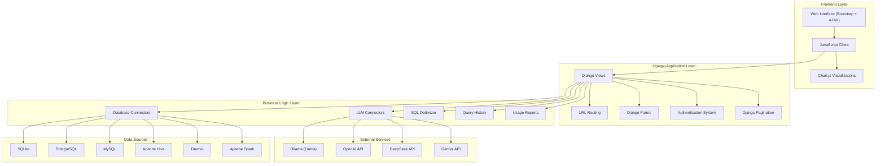

I'll create a comprehensive architecture diagram for the updated GenAI Query Analyzer project with the new Usage Report functionality using Mermaid diagrams.

```markdown
# GenAI Query Analyzer - Updated Project Architecture

## 1. High-Level System Architecture



## 2. Updated Django Application Structure

```mermaid
Diagram.download-icon {
            cursor: pointer;
            transform-origin: center;
        }
        .download-icon .arrow-part {
            transition: transform 0.35s cubic-bezier(0.35, 0.2, 0.14, 0.95);
             transform-origin: center;
        }
        button:has(.download-icon):hover .download-icon .arrow-part, button:has(.download-icon):focus-visible .download-icon .arrow-part {
          transform: translateY(-1.5px);
        }
        #mermaid-diagram-r2qf{font-family:var(--font-geist-sans);font-size:12px;fill:#000000;}#mermaid-diagram-r2qf .error-icon{fill:#552222;}#mermaid-diagram-r2qf .error-text{fill:#552222;stroke:#552222;}#mermaid-diagram-r2qf .edge-thickness-normal{stroke-width:1px;}#mermaid-diagram-r2qf .edge-thickness-thick{stroke-width:3.5px;}#mermaid-diagram-r2qf .edge-pattern-solid{stroke-dasharray:0;}#mermaid-diagram-r2qf .edge-thickness-invisible{stroke-width:0;fill:none;}#mermaid-diagram-r2qf .edge-pattern-dashed{stroke-dasharray:3;}#mermaid-diagram-r2qf .edge-pattern-dotted{stroke-dasharray:2;}#mermaid-diagram-r2qf .marker{fill:#666;stroke:#666;}#mermaid-diagram-r2qf .marker.cross{stroke:#666;}#mermaid-diagram-r2qf svg{font-family:var(--font-geist-sans);font-size:12px;}#mermaid-diagram-r2qf p{margin:0;}#mermaid-diagram-r2qf .label{font-family:var(--font-geist-sans);color:#000000;}#mermaid-diagram-r2qf .cluster-label text{fill:#333;}#mermaid-diagram-r2qf .cluster-label span{color:#333;}#mermaid-diagram-r2qf .cluster-label span p{background-color:transparent;}#mermaid-diagram-r2qf .label text,#mermaid-diagram-r2qf span{fill:#000000;color:#000000;}#mermaid-diagram-r2qf .node rect,#mermaid-diagram-r2qf .node circle,#mermaid-diagram-r2qf .node ellipse,#mermaid-diagram-r2qf .node polygon,#mermaid-diagram-r2qf .node path{fill:#eee;stroke:#999;stroke-width:1px;}#mermaid-diagram-r2qf .rough-node .label text,#mermaid-diagram-r2qf .node .label text{text-anchor:middle;}#mermaid-diagram-r2qf .node .katex path{fill:#000;stroke:#000;stroke-width:1px;}#mermaid-diagram-r2qf .node .label{text-align:center;}#mermaid-diagram-r2qf .node.clickable{cursor:pointer;}#mermaid-diagram-r2qf .arrowheadPath{fill:#333333;}#mermaid-diagram-r2qf .edgePath .path{stroke:#666;stroke-width:2.0px;}#mermaid-diagram-r2qf .flowchart-link{stroke:#666;fill:none;}#mermaid-diagram-r2qf .edgeLabel{background-color:white;text-align:center;}#mermaid-diagram-r2qf .edgeLabel p{background-color:white;}#mermaid-diagram-r2qf .edgeLabel rect{opacity:0.5;background-color:white;fill:white;}#mermaid-diagram-r2qf .labelBkg{background-color:rgba(255, 255, 255, 0.5);}#mermaid-diagram-r2qf .cluster rect{fill:hsl(0, 0%, 98.9215686275%);stroke:#707070;stroke-width:1px;}#mermaid-diagram-r2qf .cluster text{fill:#333;}#mermaid-diagram-r2qf .cluster span{color:#333;}#mermaid-diagram-r2qf div.mermaidTooltip{position:absolute;text-align:center;max-width:200px;padding:2px;font-family:var(--font-geist-sans);font-size:12px;background:hsl(-160, 0%, 93.3333333333%);border:1px solid #707070;border-radius:2px;pointer-events:none;z-index:100;}#mermaid-diagram-r2qf .flowchartTitleText{text-anchor:middle;font-size:18px;fill:#000000;}#mermaid-diagram-r2qf .flowchart-link{stroke:hsl(var(--gray-400));stroke-width:1px;}#mermaid-diagram-r2qf .marker,#mermaid-diagram-r2qf marker,#mermaid-diagram-r2qf marker *{fill:hsl(var(--gray-400))!important;stroke:hsl(var(--gray-400))!important;}#mermaid-diagram-r2qf .label,#mermaid-diagram-r2qf text,#mermaid-diagram-r2qf text>tspan{fill:hsl(var(--black))!important;color:hsl(var(--black))!important;}#mermaid-diagram-r2qf .background,#mermaid-diagram-r2qf rect.relationshipLabelBox{fill:hsl(var(--white))!important;}#mermaid-diagram-r2qf .entityBox,#mermaid-diagram-r2qf .attributeBoxEven{fill:hsl(var(--gray-150))!important;}#mermaid-diagram-r2qf .attributeBoxOdd{fill:hsl(var(--white))!important;}#mermaid-diagram-r2qf .label-container,#mermaid-diagram-r2qf rect.actor{fill:hsl(var(--white))!important;stroke:hsl(var(--gray-400))!important;}#mermaid-diagram-r2qf line{stroke:hsl(var(--gray-400))!important;}#mermaid-diagram-r2qf :root{--mermaid-font-family:var(--font-geist-sans);}Static FilesUtils PackageTemplatesquery_analyzer (Django App)genai_project (Main Project)settings.pyurls.pywsgi.pyasgi.pymodels.pyviews.pyurls.pyforms.pyadmin.pyapps.pybase.htmlhome.htmlsignup.htmlsignin.htmlusage_report.htmlusage_report_table.htmlllm_connector.pydb_connector.pysql_optimizer.pystyles.cssmain.jsChart.js Integration
```

## 3. Enhanced Data Flow Architecture

```mermaid
Diagram.download-icon {
            cursor: pointer;
            transform-origin: center;
        }
        .download-icon .arrow-part {
            transition: transform 0.35s cubic-bezier(0.35, 0.2, 0.14, 0.95);
             transform-origin: center;
        }
        button:has(.download-icon):hover .download-icon .arrow-part, button:has(.download-icon):focus-visible .download-icon .arrow-part {
          transform: translateY(-1.5px);
        }
        QueryHistoryDatabaseLLMDjangoFrontendUserQueryHistoryDatabaseLLMDjangoFrontendUser#mermaid-diagram-r2ql{font-family:var(--font-geist-sans);font-size:12px;fill:#000000;}#mermaid-diagram-r2ql .error-icon{fill:#552222;}#mermaid-diagram-r2ql .error-text{fill:#552222;stroke:#552222;}#mermaid-diagram-r2ql .edge-thickness-normal{stroke-width:1px;}#mermaid-diagram-r2ql .edge-thickness-thick{stroke-width:3.5px;}#mermaid-diagram-r2ql .edge-pattern-solid{stroke-dasharray:0;}#mermaid-diagram-r2ql .edge-thickness-invisible{stroke-width:0;fill:none;}#mermaid-diagram-r2ql .edge-pattern-dashed{stroke-dasharray:3;}#mermaid-diagram-r2ql .edge-pattern-dotted{stroke-dasharray:2;}#mermaid-diagram-r2ql .marker{fill:#666;stroke:#666;}#mermaid-diagram-r2ql .marker.cross{stroke:#666;}#mermaid-diagram-r2ql svg{font-family:var(--font-geist-sans);font-size:12px;}#mermaid-diagram-r2ql p{margin:0;}#mermaid-diagram-r2ql .actor{stroke:hsl(0, 0%, 83%);fill:#eee;}#mermaid-diagram-r2ql text.actor>tspan{fill:#333;stroke:none;}#mermaid-diagram-r2ql .actor-line{stroke:hsl(0, 0%, 83%);}#mermaid-diagram-r2ql .messageLine0{stroke-width:1.5;stroke-dasharray:none;stroke:#333;}#mermaid-diagram-r2ql .messageLine1{stroke-width:1.5;stroke-dasharray:2,2;stroke:#333;}#mermaid-diagram-r2ql #arrowhead path{fill:#333;stroke:#333;}#mermaid-diagram-r2ql .sequenceNumber{fill:white;}#mermaid-diagram-r2ql #sequencenumber{fill:#333;}#mermaid-diagram-r2ql #crosshead path{fill:#333;stroke:#333;}#mermaid-diagram-r2ql .messageText{fill:#333;stroke:none;}#mermaid-diagram-r2ql .labelBox{stroke:hsl(0, 0%, 83%);fill:#eee;}#mermaid-diagram-r2ql .labelText,#mermaid-diagram-r2ql .labelText>tspan{fill:#333;stroke:none;}#mermaid-diagram-r2ql .loopText,#mermaid-diagram-r2ql .loopText>tspan{fill:#333;stroke:none;}#mermaid-diagram-r2ql .loopLine{stroke-width:2px;stroke-dasharray:2,2;stroke:hsl(0, 0%, 83%);fill:hsl(0, 0%, 83%);}#mermaid-diagram-r2ql .note{stroke:#999;fill:#666;}#mermaid-diagram-r2ql .noteText,#mermaid-diagram-r2ql .noteText>tspan{fill:#fff;stroke:none;}#mermaid-diagram-r2ql .activation0{fill:#f4f4f4;stroke:#666;}#mermaid-diagram-r2ql .activation1{fill:#f4f4f4;stroke:#666;}#mermaid-diagram-r2ql .activation2{fill:#f4f4f4;stroke:#666;}#mermaid-diagram-r2ql .actorPopupMenu{position:absolute;}#mermaid-diagram-r2ql .actorPopupMenuPanel{position:absolute;fill:#eee;box-shadow:0px 8px 16px 0px rgba(0,0,0,0.2);filter:drop-shadow(3px 5px 2px rgb(0 0 0 / 0.4));}#mermaid-diagram-r2ql .actor-man line{stroke:hsl(0, 0%, 83%);fill:#eee;}#mermaid-diagram-r2ql .actor-man circle,#mermaid-diagram-r2ql line{stroke:hsl(0, 0%, 83%);fill:#eee;stroke-width:2px;}#mermaid-diagram-r2ql .flowchart-link{stroke:hsl(var(--gray-400));stroke-width:1px;}#mermaid-diagram-r2ql .marker,#mermaid-diagram-r2ql marker,#mermaid-diagram-r2ql marker *{fill:hsl(var(--gray-400))!important;stroke:hsl(var(--gray-400))!important;}#mermaid-diagram-r2ql .label,#mermaid-diagram-r2ql text,#mermaid-diagram-r2ql text>tspan{fill:hsl(var(--black))!important;color:hsl(var(--black))!important;}#mermaid-diagram-r2ql .background,#mermaid-diagram-r2ql rect.relationshipLabelBox{fill:hsl(var(--white))!important;}#mermaid-diagram-r2ql .entityBox,#mermaid-diagram-r2ql .attributeBoxEven{fill:hsl(var(--gray-150))!important;}#mermaid-diagram-r2ql .attributeBoxOdd{fill:hsl(var(--white))!important;}#mermaid-diagram-r2ql .label-container,#mermaid-diagram-r2ql rect.actor{fill:hsl(var(--white))!important;stroke:hsl(var(--gray-400))!important;}#mermaid-diagram-r2ql line{stroke:hsl(var(--gray-400))!important;}#mermaid-diagram-r2ql :root{--mermaid-font-family:var(--font-geist-sans);}Main Query FlowUsage Report FlowEnter natural language queryPOST /api/generate-sql/Send query + schemaReturn SQL querySave query historyReturn generated SQLDisplay SQLClick "Execute SQL"POST /api/execute-sql/Execute SQL queryReturn resultsReturn paginated resultsDisplay results (table/chart)Navigate to Usage ReportGET /usage-report/Query usage statisticsReturn aggregated dataReturn report data + chartsDisplay usage reportFilter by date rangeAJAX /api/usage-report-data/Query filtered dataReturn filtered statisticsReturn updated chart dataUpdate charts dynamically
```

## 4. Enhanced Database Schema

```mermaid
Diagram.download-icon {
            cursor: pointer;
            transform-origin: center;
        }
        .download-icon .arrow-part {
            transition: transform 0.35s cubic-bezier(0.35, 0.2, 0.14, 0.95);
             transform-origin: center;
        }
        button:has(.download-icon):hover .download-icon .arrow-part, button:has(.download-icon):focus-visible .download-icon .arrow-part {
          transform: translateY(-1.5px);
        }
        #mermaid-diagram-r2qs{font-family:var(--font-geist-sans);font-size:12px;fill:#000000;}#mermaid-diagram-r2qs .error-icon{fill:#552222;}#mermaid-diagram-r2qs .error-text{fill:#552222;stroke:#552222;}#mermaid-diagram-r2qs .edge-thickness-normal{stroke-width:1px;}#mermaid-diagram-r2qs .edge-thickness-thick{stroke-width:3.5px;}#mermaid-diagram-r2qs .edge-pattern-solid{stroke-dasharray:0;}#mermaid-diagram-r2qs .edge-thickness-invisible{stroke-width:0;fill:none;}#mermaid-diagram-r2qs .edge-pattern-dashed{stroke-dasharray:3;}#mermaid-diagram-r2qs .edge-pattern-dotted{stroke-dasharray:2;}#mermaid-diagram-r2qs .marker{fill:#666;stroke:#666;}#mermaid-diagram-r2qs .marker.cross{stroke:#666;}#mermaid-diagram-r2qs svg{font-family:var(--font-geist-sans);font-size:12px;}#mermaid-diagram-r2qs p{margin:0;}#mermaid-diagram-r2qs .entityBox{fill:#eee;stroke:#999;}#mermaid-diagram-r2qs .attributeBoxOdd{fill:#ffffff;stroke:#999;}#mermaid-diagram-r2qs .attributeBoxEven{fill:#f2f2f2;stroke:#999;}#mermaid-diagram-r2qs .relationshipLabelBox{fill:hsl(-160, 0%, 93.3333333333%);opacity:0.7;background-color:hsl(-160, 0%, 93.3333333333%);}#mermaid-diagram-r2qs .relationshipLabelBox rect{opacity:0.5;}#mermaid-diagram-r2qs .relationshipLine{stroke:#666;}#mermaid-diagram-r2qs .entityTitleText{text-anchor:middle;font-size:18px;fill:#000000;}#mermaid-diagram-r2qs #MD_PARENT_START{fill:#f5f5f5!important;stroke:#666!important;stroke-width:1;}#mermaid-diagram-r2qs #MD_PARENT_END{fill:#f5f5f5!important;stroke:#666!important;stroke-width:1;}#mermaid-diagram-r2qs .flowchart-link{stroke:hsl(var(--gray-400));stroke-width:1px;}#mermaid-diagram-r2qs .marker,#mermaid-diagram-r2qs marker,#mermaid-diagram-r2qs marker *{fill:hsl(var(--gray-400))!important;stroke:hsl(var(--gray-400))!important;}#mermaid-diagram-r2qs .label,#mermaid-diagram-r2qs text,#mermaid-diagram-r2qs text>tspan{fill:hsl(var(--black))!important;color:hsl(var(--black))!important;}#mermaid-diagram-r2qs .background,#mermaid-diagram-r2qs rect.relationshipLabelBox{fill:hsl(var(--white))!important;}#mermaid-diagram-r2qs .entityBox,#mermaid-diagram-r2qs .attributeBoxEven{fill:hsl(var(--gray-150))!important;}#mermaid-diagram-r2qs .attributeBoxOdd{fill:hsl(var(--white))!important;}#mermaid-diagram-r2qs .label-container,#mermaid-diagram-r2qs rect.actor{fill:hsl(var(--white))!important;stroke:hsl(var(--gray-400))!important;}#mermaid-diagram-r2qs line{stroke:hsl(var(--gray-400))!important;}#mermaid-diagram-r2qs :root{--mermaid-font-family:var(--font-geist-sans);}CustomUserintidPKstringemailUKstringpasswordbooleanis_staffbooleanis_activedatetimedate_joineddatetimelast_loginQueryHistoryintidPKintuser_idFKtextnatural_querytextgenerated_sqltextoptimized_sqlstringllm_modelstringdata_sourcestringdatabase_nametexttablesdatetimecreated_atSessionStorestringsession_keyPKtextsession_datadatetimeexpire_dateQueryResultsstringresult_idPKStored in Sessionjsoncolumnsjsondatainttotal_rowsintpage_sizehas manycontains
```

## 5. Updated URL Routing Architecture

```mermaid
Diagram.download-icon {
            cursor: pointer;
            transform-origin: center;
        }
        .download-icon .arrow-part {
            transition: transform 0.35s cubic-bezier(0.35, 0.2, 0.14, 0.95);
             transform-origin: center;
        }
        button:has(.download-icon):hover .download-icon .arrow-part, button:has(.download-icon):focus-visible .download-icon .arrow-part {
          transform: translateY(-1.5px);
        }
        #mermaid-diagram-r2r3{font-family:var(--font-geist-sans);font-size:12px;fill:#000000;}#mermaid-diagram-r2r3 .error-icon{fill:#552222;}#mermaid-diagram-r2r3 .error-text{fill:#552222;stroke:#552222;}#mermaid-diagram-r2r3 .edge-thickness-normal{stroke-width:1px;}#mermaid-diagram-r2r3 .edge-thickness-thick{stroke-width:3.5px;}#mermaid-diagram-r2r3 .edge-pattern-solid{stroke-dasharray:0;}#mermaid-diagram-r2r3 .edge-thickness-invisible{stroke-width:0;fill:none;}#mermaid-diagram-r2r3 .edge-pattern-dashed{stroke-dasharray:3;}#mermaid-diagram-r2r3 .edge-pattern-dotted{stroke-dasharray:2;}#mermaid-diagram-r2r3 .marker{fill:#666;stroke:#666;}#mermaid-diagram-r2r3 .marker.cross{stroke:#666;}#mermaid-diagram-r2r3 svg{font-family:var(--font-geist-sans);font-size:12px;}#mermaid-diagram-r2r3 p{margin:0;}#mermaid-diagram-r2r3 .label{font-family:var(--font-geist-sans);color:#000000;}#mermaid-diagram-r2r3 .cluster-label text{fill:#333;}#mermaid-diagram-r2r3 .cluster-label span{color:#333;}#mermaid-diagram-r2r3 .cluster-label span p{background-color:transparent;}#mermaid-diagram-r2r3 .label text,#mermaid-diagram-r2r3 span{fill:#000000;color:#000000;}#mermaid-diagram-r2r3 .node rect,#mermaid-diagram-r2r3 .node circle,#mermaid-diagram-r2r3 .node ellipse,#mermaid-diagram-r2r3 .node polygon,#mermaid-diagram-r2r3 .node path{fill:#eee;stroke:#999;stroke-width:1px;}#mermaid-diagram-r2r3 .rough-node .label text,#mermaid-diagram-r2r3 .node .label text{text-anchor:middle;}#mermaid-diagram-r2r3 .node .katex path{fill:#000;stroke:#000;stroke-width:1px;}#mermaid-diagram-r2r3 .node .label{text-align:center;}#mermaid-diagram-r2r3 .node.clickable{cursor:pointer;}#mermaid-diagram-r2r3 .arrowheadPath{fill:#333333;}#mermaid-diagram-r2r3 .edgePath .path{stroke:#666;stroke-width:2.0px;}#mermaid-diagram-r2r3 .flowchart-link{stroke:#666;fill:none;}#mermaid-diagram-r2r3 .edgeLabel{background-color:white;text-align:center;}#mermaid-diagram-r2r3 .edgeLabel p{background-color:white;}#mermaid-diagram-r2r3 .edgeLabel rect{opacity:0.5;background-color:white;fill:white;}#mermaid-diagram-r2r3 .labelBkg{background-color:rgba(255, 255, 255, 0.5);}#mermaid-diagram-r2r3 .cluster rect{fill:hsl(0, 0%, 98.9215686275%);stroke:#707070;stroke-width:1px;}#mermaid-diagram-r2r3 .cluster text{fill:#333;}#mermaid-diagram-r2r3 .cluster span{color:#333;}#mermaid-diagram-r2r3 div.mermaidTooltip{position:absolute;text-align:center;max-width:200px;padding:2px;font-family:var(--font-geist-sans);font-size:12px;background:hsl(-160, 0%, 93.3333333333%);border:1px solid #707070;border-radius:2px;pointer-events:none;z-index:100;}#mermaid-diagram-r2r3 .flowchartTitleText{text-anchor:middle;font-size:18px;fill:#000000;}#mermaid-diagram-r2r3 .flowchart-link{stroke:hsl(var(--gray-400));stroke-width:1px;}#mermaid-diagram-r2r3 .marker,#mermaid-diagram-r2r3 marker,#mermaid-diagram-r2r3 marker *{fill:hsl(var(--gray-400))!important;stroke:hsl(var(--gray-400))!important;}#mermaid-diagram-r2r3 .label,#mermaid-diagram-r2r3 text,#mermaid-diagram-r2r3 text>tspan{fill:hsl(var(--black))!important;color:hsl(var(--black))!important;}#mermaid-diagram-r2r3 .background,#mermaid-diagram-r2r3 rect.relationshipLabelBox{fill:hsl(var(--white))!important;}#mermaid-diagram-r2r3 .entityBox,#mermaid-diagram-r2r3 .attributeBoxEven{fill:hsl(var(--gray-150))!important;}#mermaid-diagram-r2r3 .attributeBoxOdd{fill:hsl(var(--white))!important;}#mermaid-diagram-r2r3 .label-container,#mermaid-diagram-r2r3 rect.actor{fill:hsl(var(--white))!important;stroke:hsl(var(--gray-400))!important;}#mermaid-diagram-r2r3 line{stroke:hsl(var(--gray-400))!important;}#mermaid-diagram-r2r3 :root{--mermaid-font-family:var(--font-geist-sans);}ViewsAPI URLsMain URLsAuthentication URLs/signup//signin//signout///usage-report//api/get-databases//api/get-tables//api/generate-sql//api/optimize-sql//api/execute-sql//api/get-result-page//api/update-page-size//api/usage-report-data/signup_view()signin_view()signout_view()home_view()usage_report_view()get_databases()get_tables()generate_sql()optimize_sql()execute_sql()get_result_page()update_page_size()usage_report_data()
```

## 6. Pagination Architecture

```mermaid
Diagram.download-icon {
            cursor: pointer;
            transform-origin: center;
        }
        .download-icon .arrow-part {
            transition: transform 0.35s cubic-bezier(0.35, 0.2, 0.14, 0.95);
             transform-origin: center;
        }
        button:has(.download-icon):hover .download-icon .arrow-part, button:has(.download-icon):focus-visible .download-icon .arrow-part {
          transform: translateY(-1.5px);
        }
        #mermaid-diagram-r2ra{font-family:var(--font-geist-sans);font-size:12px;fill:#000000;}#mermaid-diagram-r2ra .error-icon{fill:#552222;}#mermaid-diagram-r2ra .error-text{fill:#552222;stroke:#552222;}#mermaid-diagram-r2ra .edge-thickness-normal{stroke-width:1px;}#mermaid-diagram-r2ra .edge-thickness-thick{stroke-width:3.5px;}#mermaid-diagram-r2ra .edge-pattern-solid{stroke-dasharray:0;}#mermaid-diagram-r2ra .edge-thickness-invisible{stroke-width:0;fill:none;}#mermaid-diagram-r2ra .edge-pattern-dashed{stroke-dasharray:3;}#mermaid-diagram-r2ra .edge-pattern-dotted{stroke-dasharray:2;}#mermaid-diagram-r2ra .marker{fill:#666;stroke:#666;}#mermaid-diagram-r2ra .marker.cross{stroke:#666;}#mermaid-diagram-r2ra svg{font-family:var(--font-geist-sans);font-size:12px;}#mermaid-diagram-r2ra p{margin:0;}#mermaid-diagram-r2ra .label{font-family:var(--font-geist-sans);color:#000000;}#mermaid-diagram-r2ra .cluster-label text{fill:#333;}#mermaid-diagram-r2ra .cluster-label span{color:#333;}#mermaid-diagram-r2ra .cluster-label span p{background-color:transparent;}#mermaid-diagram-r2ra .label text,#mermaid-diagram-r2ra span{fill:#000000;color:#000000;}#mermaid-diagram-r2ra .node rect,#mermaid-diagram-r2ra .node circle,#mermaid-diagram-r2ra .node ellipse,#mermaid-diagram-r2ra .node polygon,#mermaid-diagram-r2ra .node path{fill:#eee;stroke:#999;stroke-width:1px;}#mermaid-diagram-r2ra .rough-node .label text,#mermaid-diagram-r2ra .node .label text{text-anchor:middle;}#mermaid-diagram-r2ra .node .katex path{fill:#000;stroke:#000;stroke-width:1px;}#mermaid-diagram-r2ra .node .label{text-align:center;}#mermaid-diagram-r2ra .node.clickable{cursor:pointer;}#mermaid-diagram-r2ra .arrowheadPath{fill:#333333;}#mermaid-diagram-r2ra .edgePath .path{stroke:#666;stroke-width:2.0px;}#mermaid-diagram-r2ra .flowchart-link{stroke:#666;fill:none;}#mermaid-diagram-r2ra .edgeLabel{background-color:white;text-align:center;}#mermaid-diagram-r2ra .edgeLabel p{background-color:white;}#mermaid-diagram-r2ra .edgeLabel rect{opacity:0.5;background-color:white;fill:white;}#mermaid-diagram-r2ra .labelBkg{background-color:rgba(255, 255, 255, 0.5);}#mermaid-diagram-r2ra .cluster rect{fill:hsl(0, 0%, 98.9215686275%);stroke:#707070;stroke-width:1px;}#mermaid-diagram-r2ra .cluster text{fill:#333;}#mermaid-diagram-r2ra .cluster span{color:#333;}#mermaid-diagram-r2ra div.mermaidTooltip{position:absolute;text-align:center;max-width:200px;padding:2px;font-family:var(--font-geist-sans);font-size:12px;background:hsl(-160, 0%, 93.3333333333%);border:1px solid #707070;border-radius:2px;pointer-events:none;z-index:100;}#mermaid-diagram-r2ra .flowchartTitleText{text-anchor:middle;font-size:18px;fill:#000000;}#mermaid-diagram-r2ra .flowchart-link{stroke:hsl(var(--gray-400));stroke-width:1px;}#mermaid-diagram-r2ra .marker,#mermaid-diagram-r2ra marker,#mermaid-diagram-r2ra marker *{fill:hsl(var(--gray-400))!important;stroke:hsl(var(--gray-400))!important;}#mermaid-diagram-r2ra .label,#mermaid-diagram-r2ra text,#mermaid-diagram-r2ra text>tspan{fill:hsl(var(--black))!important;color:hsl(var(--black))!important;}#mermaid-diagram-r2ra .background,#mermaid-diagram-r2ra rect.relationshipLabelBox{fill:hsl(var(--white))!important;}#mermaid-diagram-r2ra .entityBox,#mermaid-diagram-r2ra .attributeBoxEven{fill:hsl(var(--gray-150))!important;}#mermaid-diagram-r2ra .attributeBoxOdd{fill:hsl(var(--white))!important;}#mermaid-diagram-r2ra .label-container,#mermaid-diagram-r2ra rect.actor{fill:hsl(var(--white))!important;stroke:hsl(var(--gray-400))!important;}#mermaid-diagram-r2ra line{stroke:hsl(var(--gray-400))!important;}#mermaid-diagram-r2ra :root{--mermaid-font-family:var(--font-geist-sans);}Frontend PaginationUsage Report PaginationQuery Results PaginationSession StorageUnique Result IDComplete Result SetPage Calculation LogicDjango PaginatorQueryHistory QuerySetPage ObjectPagination ControlsAJAX Page RequestsDynamic Table Update
```

## 7. Usage Report Architecture

```mermaid
Diagram.download-icon {
            cursor: pointer;
            transform-origin: center;
        }
        .download-icon .arrow-part {
            transition: transform 0.35s cubic-bezier(0.35, 0.2, 0.14, 0.95);
             transform-origin: center;
        }
        button:has(.download-icon):hover .download-icon .arrow-part, button:has(.download-icon):focus-visible .download-icon .arrow-part {
          transform: translateY(-1.5px);
        }
        #mermaid-diagram-r2rh{font-family:var(--font-geist-sans);font-size:12px;fill:#000000;}#mermaid-diagram-r2rh .error-icon{fill:#552222;}#mermaid-diagram-r2rh .error-text{fill:#552222;stroke:#552222;}#mermaid-diagram-r2rh .edge-thickness-normal{stroke-width:1px;}#mermaid-diagram-r2rh .edge-thickness-thick{stroke-width:3.5px;}#mermaid-diagram-r2rh .edge-pattern-solid{stroke-dasharray:0;}#mermaid-diagram-r2rh .edge-thickness-invisible{stroke-width:0;fill:none;}#mermaid-diagram-r2rh .edge-pattern-dashed{stroke-dasharray:3;}#mermaid-diagram-r2rh .edge-pattern-dotted{stroke-dasharray:2;}#mermaid-diagram-r2rh .marker{fill:#666;stroke:#666;}#mermaid-diagram-r2rh .marker.cross{stroke:#666;}#mermaid-diagram-r2rh svg{font-family:var(--font-geist-sans);font-size:12px;}#mermaid-diagram-r2rh p{margin:0;}#mermaid-diagram-r2rh .label{font-family:var(--font-geist-sans);color:#000000;}#mermaid-diagram-r2rh .cluster-label text{fill:#333;}#mermaid-diagram-r2rh .cluster-label span{color:#333;}#mermaid-diagram-r2rh .cluster-label span p{background-color:transparent;}#mermaid-diagram-r2rh .label text,#mermaid-diagram-r2rh span{fill:#000000;color:#000000;}#mermaid-diagram-r2rh .node rect,#mermaid-diagram-r2rh .node circle,#mermaid-diagram-r2rh .node ellipse,#mermaid-diagram-r2rh .node polygon,#mermaid-diagram-r2rh .node path{fill:#eee;stroke:#999;stroke-width:1px;}#mermaid-diagram-r2rh .rough-node .label text,#mermaid-diagram-r2rh .node .label text{text-anchor:middle;}#mermaid-diagram-r2rh .node .katex path{fill:#000;stroke:#000;stroke-width:1px;}#mermaid-diagram-r2rh .node .label{text-align:center;}#mermaid-diagram-r2rh .node.clickable{cursor:pointer;}#mermaid-diagram-r2rh .arrowheadPath{fill:#333333;}#mermaid-diagram-r2rh .edgePath .path{stroke:#666;stroke-width:2.0px;}#mermaid-diagram-r2rh .flowchart-link{stroke:#666;fill:none;}#mermaid-diagram-r2rh .edgeLabel{background-color:white;text-align:center;}#mermaid-diagram-r2rh .edgeLabel p{background-color:white;}#mermaid-diagram-r2rh .edgeLabel rect{opacity:0.5;background-color:white;fill:white;}#mermaid-diagram-r2rh .labelBkg{background-color:rgba(255, 255, 255, 0.5);}#mermaid-diagram-r2rh .cluster rect{fill:hsl(0, 0%, 98.9215686275%);stroke:#707070;stroke-width:1px;}#mermaid-diagram-r2rh .cluster text{fill:#333;}#mermaid-diagram-r2rh .cluster span{color:#333;}#mermaid-diagram-r2rh div.mermaidTooltip{position:absolute;text-align:center;max-width:200px;padding:2px;font-family:var(--font-geist-sans);font-size:12px;background:hsl(-160, 0%, 93.3333333333%);border:1px solid #707070;border-radius:2px;pointer-events:none;z-index:100;}#mermaid-diagram-r2rh .flowchartTitleText{text-anchor:middle;font-size:18px;fill:#000000;}#mermaid-diagram-r2rh .flowchart-link{stroke:hsl(var(--gray-400));stroke-width:1px;}#mermaid-diagram-r2rh .marker,#mermaid-diagram-r2rh marker,#mermaid-diagram-r2rh marker *{fill:hsl(var(--gray-400))!important;stroke:hsl(var(--gray-400))!important;}#mermaid-diagram-r2rh .label,#mermaid-diagram-r2rh text,#mermaid-diagram-r2rh text>tspan{fill:hsl(var(--black))!important;color:hsl(var(--black))!important;}#mermaid-diagram-r2rh .background,#mermaid-diagram-r2rh rect.relationshipLabelBox{fill:hsl(var(--white))!important;}#mermaid-diagram-r2rh .entityBox,#mermaid-diagram-r2rh .attributeBoxEven{fill:hsl(var(--gray-150))!important;}#mermaid-diagram-r2rh .attributeBoxOdd{fill:hsl(var(--white))!important;}#mermaid-diagram-r2rh .label-container,#mermaid-diagram-r2rh rect.actor{fill:hsl(var(--white))!important;stroke:hsl(var(--gray-400))!important;}#mermaid-diagram-r2rh line{stroke:hsl(var(--gray-400))!important;}#mermaid-diagram-r2rh :root{--mermaid-font-family:var(--font-geist-sans);}AJAX UpdatesData ProcessingReport ComponentsDate Range FilterLLM Usage Bar ChartData Source Bar ChartDatabase Pie ChartQuery History TableQuery AggregationChart Data PreparationTable PaginationDate Range UpdateChart UpdateTable UpdatePagination Update
```

## 8. Chart.js Integration Architecture

```mermaid
Diagram.download-icon {
            cursor: pointer;
            transform-origin: center;
        }
        .download-icon .arrow-part {
            transition: transform 0.35s cubic-bezier(0.35, 0.2, 0.14, 0.95);
             transform-origin: center;
        }
        button:has(.download-icon):hover .download-icon .arrow-part, button:has(.download-icon):focus-visible .download-icon .arrow-part {
          transform: translateY(-1.5px);
        }
        #mermaid-diagram-r2ro{font-family:var(--font-geist-sans);font-size:12px;fill:#000000;}#mermaid-diagram-r2ro .error-icon{fill:#552222;}#mermaid-diagram-r2ro .error-text{fill:#552222;stroke:#552222;}#mermaid-diagram-r2ro .edge-thickness-normal{stroke-width:1px;}#mermaid-diagram-r2ro .edge-thickness-thick{stroke-width:3.5px;}#mermaid-diagram-r2ro .edge-pattern-solid{stroke-dasharray:0;}#mermaid-diagram-r2ro .edge-thickness-invisible{stroke-width:0;fill:none;}#mermaid-diagram-r2ro .edge-pattern-dashed{stroke-dasharray:3;}#mermaid-diagram-r2ro .edge-pattern-dotted{stroke-dasharray:2;}#mermaid-diagram-r2ro .marker{fill:#666;stroke:#666;}#mermaid-diagram-r2ro .marker.cross{stroke:#666;}#mermaid-diagram-r2ro svg{font-family:var(--font-geist-sans);font-size:12px;}#mermaid-diagram-r2ro p{margin:0;}#mermaid-diagram-r2ro .label{font-family:var(--font-geist-sans);color:#000000;}#mermaid-diagram-r2ro .cluster-label text{fill:#333;}#mermaid-diagram-r2ro .cluster-label span{color:#333;}#mermaid-diagram-r2ro .cluster-label span p{background-color:transparent;}#mermaid-diagram-r2ro .label text,#mermaid-diagram-r2ro span{fill:#000000;color:#000000;}#mermaid-diagram-r2ro .node rect,#mermaid-diagram-r2ro .node circle,#mermaid-diagram-r2ro .node ellipse,#mermaid-diagram-r2ro .node polygon,#mermaid-diagram-r2ro .node path{fill:#eee;stroke:#999;stroke-width:1px;}#mermaid-diagram-r2ro .rough-node .label text,#mermaid-diagram-r2ro .node .label text{text-anchor:middle;}#mermaid-diagram-r2ro .node .katex path{fill:#000;stroke:#000;stroke-width:1px;}#mermaid-diagram-r2ro .node .label{text-align:center;}#mermaid-diagram-r2ro .node.clickable{cursor:pointer;}#mermaid-diagram-r2ro .arrowheadPath{fill:#333333;}#mermaid-diagram-r2ro .edgePath .path{stroke:#666;stroke-width:2.0px;}#mermaid-diagram-r2ro .flowchart-link{stroke:#666;fill:none;}#mermaid-diagram-r2ro .edgeLabel{background-color:white;text-align:center;}#mermaid-diagram-r2ro .edgeLabel p{background-color:white;}#mermaid-diagram-r2ro .edgeLabel rect{opacity:0.5;background-color:white;fill:white;}#mermaid-diagram-r2ro .labelBkg{background-color:rgba(255, 255, 255, 0.5);}#mermaid-diagram-r2ro .cluster rect{fill:hsl(0, 0%, 98.9215686275%);stroke:#707070;stroke-width:1px;}#mermaid-diagram-r2ro .cluster text{fill:#333;}#mermaid-diagram-r2ro .cluster span{color:#333;}#mermaid-diagram-r2ro div.mermaidTooltip{position:absolute;text-align:center;max-width:200px;padding:2px;font-family:var(--font-geist-sans);font-size:12px;background:hsl(-160, 0%, 93.3333333333%);border:1px solid #707070;border-radius:2px;pointer-events:none;z-index:100;}#mermaid-diagram-r2ro .flowchartTitleText{text-anchor:middle;font-size:18px;fill:#000000;}#mermaid-diagram-r2ro .flowchart-link{stroke:hsl(var(--gray-400));stroke-width:1px;}#mermaid-diagram-r2ro .marker,#mermaid-diagram-r2ro marker,#mermaid-diagram-r2ro marker *{fill:hsl(var(--gray-400))!important;stroke:hsl(var(--gray-400))!important;}#mermaid-diagram-r2ro .label,#mermaid-diagram-r2ro text,#mermaid-diagram-r2ro text>tspan{fill:hsl(var(--black))!important;color:hsl(var(--black))!important;}#mermaid-diagram-r2ro .background,#mermaid-diagram-r2ro rect.relationshipLabelBox{fill:hsl(var(--white))!important;}#mermaid-diagram-r2ro .entityBox,#mermaid-diagram-r2ro .attributeBoxEven{fill:hsl(var(--gray-150))!important;}#mermaid-diagram-r2ro .attributeBoxOdd{fill:hsl(var(--white))!important;}#mermaid-diagram-r2ro .label-container,#mermaid-diagram-r2ro rect.actor{fill:hsl(var(--white))!important;stroke:hsl(var(--gray-400))!important;}#mermaid-diagram-r2ro line{stroke:hsl(var(--gray-400))!important;}#mermaid-diagram-r2ro :root{--mermaid-font-family:var(--font-geist-sans);}Chart FeaturesData SourcesChart TypesBar Charts (LLM &amp; DataSource)Pie Chart (Database Usage)Result Visualization ChartUsage StatisticsQuery Execution ResultsAggregated MetricsResponsive DesignInteractive TooltipsDynamic Color GenerationChart Instance Management
```

## 9. Enhanced Frontend Component Architecture

```mermaid
Diagram.download-icon {
            cursor: pointer;
            transform-origin: center;
        }
        .download-icon .arrow-part {
            transition: transform 0.35s cubic-bezier(0.35, 0.2, 0.14, 0.95);
             transform-origin: center;
        }
        button:has(.download-icon):hover .download-icon .arrow-part, button:has(.download-icon):focus-visible .download-icon .arrow-part {
          transform: translateY(-1.5px);
        }
        #mermaid-diagram-r2s0{font-family:var(--font-geist-sans);font-size:12px;fill:#000000;}#mermaid-diagram-r2s0 .error-icon{fill:#552222;}#mermaid-diagram-r2s0 .error-text{fill:#552222;stroke:#552222;}#mermaid-diagram-r2s0 .edge-thickness-normal{stroke-width:1px;}#mermaid-diagram-r2s0 .edge-thickness-thick{stroke-width:3.5px;}#mermaid-diagram-r2s0 .edge-pattern-solid{stroke-dasharray:0;}#mermaid-diagram-r2s0 .edge-thickness-invisible{stroke-width:0;fill:none;}#mermaid-diagram-r2s0 .edge-pattern-dashed{stroke-dasharray:3;}#mermaid-diagram-r2s0 .edge-pattern-dotted{stroke-dasharray:2;}#mermaid-diagram-r2s0 .marker{fill:#666;stroke:#666;}#mermaid-diagram-r2s0 .marker.cross{stroke:#666;}#mermaid-diagram-r2s0 svg{font-family:var(--font-geist-sans);font-size:12px;}#mermaid-diagram-r2s0 p{margin:0;}#mermaid-diagram-r2s0 .label{font-family:var(--font-geist-sans);color:#000000;}#mermaid-diagram-r2s0 .cluster-label text{fill:#333;}#mermaid-diagram-r2s0 .cluster-label span{color:#333;}#mermaid-diagram-r2s0 .cluster-label span p{background-color:transparent;}#mermaid-diagram-r2s0 .label text,#mermaid-diagram-r2s0 span{fill:#000000;color:#000000;}#mermaid-diagram-r2s0 .node rect,#mermaid-diagram-r2s0 .node circle,#mermaid-diagram-r2s0 .node ellipse,#mermaid-diagram-r2s0 .node polygon,#mermaid-diagram-r2s0 .node path{fill:#eee;stroke:#999;stroke-width:1px;}#mermaid-diagram-r2s0 .rough-node .label text,#mermaid-diagram-r2s0 .node .label text{text-anchor:middle;}#mermaid-diagram-r2s0 .node .katex path{fill:#000;stroke:#000;stroke-width:1px;}#mermaid-diagram-r2s0 .node .label{text-align:center;}#mermaid-diagram-r2s0 .node.clickable{cursor:pointer;}#mermaid-diagram-r2s0 .arrowheadPath{fill:#333333;}#mermaid-diagram-r2s0 .edgePath .path{stroke:#666;stroke-width:2.0px;}#mermaid-diagram-r2s0 .flowchart-link{stroke:#666;fill:none;}#mermaid-diagram-r2s0 .edgeLabel{background-color:white;text-align:center;}#mermaid-diagram-r2s0 .edgeLabel p{background-color:white;}#mermaid-diagram-r2s0 .edgeLabel rect{opacity:0.5;background-color:white;fill:white;}#mermaid-diagram-r2s0 .labelBkg{background-color:rgba(255, 255, 255, 0.5);}#mermaid-diagram-r2s0 .cluster rect{fill:hsl(0, 0%, 98.9215686275%);stroke:#707070;stroke-width:1px;}#mermaid-diagram-r2s0 .cluster text{fill:#333;}#mermaid-diagram-r2s0 .cluster span{color:#333;}#mermaid-diagram-r2s0 div.mermaidTooltip{position:absolute;text-align:center;max-width:200px;padding:2px;font-family:var(--font-geist-sans);font-size:12px;background:hsl(-160, 0%, 93.3333333333%);border:1px solid #707070;border-radius:2px;pointer-events:none;z-index:100;}#mermaid-diagram-r2s0 .flowchartTitleText{text-anchor:middle;font-size:18px;fill:#000000;}#mermaid-diagram-r2s0 .flowchart-link{stroke:hsl(var(--gray-400));stroke-width:1px;}#mermaid-diagram-r2s0 .marker,#mermaid-diagram-r2s0 marker,#mermaid-diagram-r2s0 marker *{fill:hsl(var(--gray-400))!important;stroke:hsl(var(--gray-400))!important;}#mermaid-diagram-r2s0 .label,#mermaid-diagram-r2s0 text,#mermaid-diagram-r2s0 text>tspan{fill:hsl(var(--black))!important;color:hsl(var(--black))!important;}#mermaid-diagram-r2s0 .background,#mermaid-diagram-r2s0 rect.relationshipLabelBox{fill:hsl(var(--white))!important;}#mermaid-diagram-r2s0 .entityBox,#mermaid-diagram-r2s0 .attributeBoxEven{fill:hsl(var(--gray-150))!important;}#mermaid-diagram-r2s0 .attributeBoxOdd{fill:hsl(var(--white))!important;}#mermaid-diagram-r2s0 .label-container,#mermaid-diagram-r2s0 rect.actor{fill:hsl(var(--white))!important;stroke:hsl(var(--gray-400))!important;}#mermaid-diagram-r2s0 line{stroke:hsl(var(--gray-400))!important;}#mermaid-diagram-r2s0 :root{--mermaid-font-family:var(--font-geist-sans);}Event HandlersJavaScript FunctionsUsage Report ComponentsHome Page ComponentsLLM Model SelectionData Source SelectionDatabase DropdownTables CheckboxQuery TextareaAction ButtonsEnhanced Progress BarSQL DisplayPaginated Results TableResults ChartPagination ControlsDate Range FilterLLM Usage ChartData Source Usage ChartDatabase Usage ChartQuery History TableReport PaginationloadDatabases()loadTables()generateSQL()optimizeSQL()executeSQL()loadPage()updatePageSize()createCharts()updateReport()setupPaginationLinks()Data Source ChangeDatabase ChangeButton ClicksPage Navigation ClicksDate Filter SubmitPage Size Change
```

## 10. Session Management Architecture

```mermaid
Diagram.download-icon {
            cursor: pointer;
            transform-origin: center;
        }
        .download-icon .arrow-part {
            transition: transform 0.35s cubic-bezier(0.35, 0.2, 0.14, 0.95);
             transform-origin: center;
        }
        button:has(.download-icon):hover .download-icon .arrow-part, button:has(.download-icon):focus-visible .download-icon .arrow-part {
          transform: translateY(-1.5px);
        }
        #mermaid-diagram-r2s7{font-family:var(--font-geist-sans);font-size:12px;fill:#000000;}#mermaid-diagram-r2s7 .error-icon{fill:#552222;}#mermaid-diagram-r2s7 .error-text{fill:#552222;stroke:#552222;}#mermaid-diagram-r2s7 .edge-thickness-normal{stroke-width:1px;}#mermaid-diagram-r2s7 .edge-thickness-thick{stroke-width:3.5px;}#mermaid-diagram-r2s7 .edge-pattern-solid{stroke-dasharray:0;}#mermaid-diagram-r2s7 .edge-thickness-invisible{stroke-width:0;fill:none;}#mermaid-diagram-r2s7 .edge-pattern-dashed{stroke-dasharray:3;}#mermaid-diagram-r2s7 .edge-pattern-dotted{stroke-dasharray:2;}#mermaid-diagram-r2s7 .marker{fill:#666;stroke:#666;}#mermaid-diagram-r2s7 .marker.cross{stroke:#666;}#mermaid-diagram-r2s7 svg{font-family:var(--font-geist-sans);font-size:12px;}#mermaid-diagram-r2s7 p{margin:0;}#mermaid-diagram-r2s7 .label{font-family:var(--font-geist-sans);color:#000000;}#mermaid-diagram-r2s7 .cluster-label text{fill:#333;}#mermaid-diagram-r2s7 .cluster-label span{color:#333;}#mermaid-diagram-r2s7 .cluster-label span p{background-color:transparent;}#mermaid-diagram-r2s7 .label text,#mermaid-diagram-r2s7 span{fill:#000000;color:#000000;}#mermaid-diagram-r2s7 .node rect,#mermaid-diagram-r2s7 .node circle,#mermaid-diagram-r2s7 .node ellipse,#mermaid-diagram-r2s7 .node polygon,#mermaid-diagram-r2s7 .node path{fill:#eee;stroke:#999;stroke-width:1px;}#mermaid-diagram-r2s7 .rough-node .label text,#mermaid-diagram-r2s7 .node .label text{text-anchor:middle;}#mermaid-diagram-r2s7 .node .katex path{fill:#000;stroke:#000;stroke-width:1px;}#mermaid-diagram-r2s7 .node .label{text-align:center;}#mermaid-diagram-r2s7 .node.clickable{cursor:pointer;}#mermaid-diagram-r2s7 .arrowheadPath{fill:#333333;}#mermaid-diagram-r2s7 .edgePath .path{stroke:#666;stroke-width:2.0px;}#mermaid-diagram-r2s7 .flowchart-link{stroke:#666;fill:none;}#mermaid-diagram-r2s7 .edgeLabel{background-color:white;text-align:center;}#mermaid-diagram-r2s7 .edgeLabel p{background-color:white;}#mermaid-diagram-r2s7 .edgeLabel rect{opacity:0.5;background-color:white;fill:white;}#mermaid-diagram-r2s7 .labelBkg{background-color:rgba(255, 255, 255, 0.5);}#mermaid-diagram-r2s7 .cluster rect{fill:hsl(0, 0%, 98.9215686275%);stroke:#707070;stroke-width:1px;}#mermaid-diagram-r2s7 .cluster text{fill:#333;}#mermaid-diagram-r2s7 .cluster span{color:#333;}#mermaid-diagram-r2s7 div.mermaidTooltip{position:absolute;text-align:center;max-width:200px;padding:2px;font-family:var(--font-geist-sans);font-size:12px;background:hsl(-160, 0%, 93.3333333333%);border:1px solid #707070;border-radius:2px;pointer-events:none;z-index:100;}#mermaid-diagram-r2s7 .flowchartTitleText{text-anchor:middle;font-size:18px;fill:#000000;}#mermaid-diagram-r2s7 .flowchart-link{stroke:hsl(var(--gray-400));stroke-width:1px;}#mermaid-diagram-r2s7 .marker,#mermaid-diagram-r2s7 marker,#mermaid-diagram-r2s7 marker *{fill:hsl(var(--gray-400))!important;stroke:hsl(var(--gray-400))!important;}#mermaid-diagram-r2s7 .label,#mermaid-diagram-r2s7 text,#mermaid-diagram-r2s7 text>tspan{fill:hsl(var(--black))!important;color:hsl(var(--black))!important;}#mermaid-diagram-r2s7 .background,#mermaid-diagram-r2s7 rect.relationshipLabelBox{fill:hsl(var(--white))!important;}#mermaid-diagram-r2s7 .entityBox,#mermaid-diagram-r2s7 .attributeBoxEven{fill:hsl(var(--gray-150))!important;}#mermaid-diagram-r2s7 .attributeBoxOdd{fill:hsl(var(--white))!important;}#mermaid-diagram-r2s7 .label-container,#mermaid-diagram-r2s7 rect.actor{fill:hsl(var(--white))!important;stroke:hsl(var(--gray-400))!important;}#mermaid-diagram-r2s7 line{stroke:hsl(var(--gray-400))!important;}#mermaid-diagram-r2s7 :root{--mermaid-font-family:var(--font-geist-sans);}Session SecuritySession OperationsSession DataQuery Results CacheUser Session DataResult MetadataStore Query ResultsRetrieve Paginated DataUpdate Page SizeSession CleanupUser Data IsolationSession ExpirationData Validation
```

## 11. Enhanced Security Architecture

```mermaid
Diagram.download-icon {
            cursor: pointer;
            transform-origin: center;
        }
        .download-icon .arrow-part {
            transition: transform 0.35s cubic-bezier(0.35, 0.2, 0.14, 0.95);
             transform-origin: center;
        }
        button:has(.download-icon):hover .download-icon .arrow-part, button:has(.download-icon):focus-visible .download-icon .arrow-part {
          transform: translateY(-1.5px);
        }
        #mermaid-diagram-r2se{font-family:var(--font-geist-sans);font-size:12px;fill:#000000;}#mermaid-diagram-r2se .error-icon{fill:#552222;}#mermaid-diagram-r2se .error-text{fill:#552222;stroke:#552222;}#mermaid-diagram-r2se .edge-thickness-normal{stroke-width:1px;}#mermaid-diagram-r2se .edge-thickness-thick{stroke-width:3.5px;}#mermaid-diagram-r2se .edge-pattern-solid{stroke-dasharray:0;}#mermaid-diagram-r2se .edge-thickness-invisible{stroke-width:0;fill:none;}#mermaid-diagram-r2se .edge-pattern-dashed{stroke-dasharray:3;}#mermaid-diagram-r2se .edge-pattern-dotted{stroke-dasharray:2;}#mermaid-diagram-r2se .marker{fill:#666;stroke:#666;}#mermaid-diagram-r2se .marker.cross{stroke:#666;}#mermaid-diagram-r2se svg{font-family:var(--font-geist-sans);font-size:12px;}#mermaid-diagram-r2se p{margin:0;}#mermaid-diagram-r2se .label{font-family:var(--font-geist-sans);color:#000000;}#mermaid-diagram-r2se .cluster-label text{fill:#333;}#mermaid-diagram-r2se .cluster-label span{color:#333;}#mermaid-diagram-r2se .cluster-label span p{background-color:transparent;}#mermaid-diagram-r2se .label text,#mermaid-diagram-r2se span{fill:#000000;color:#000000;}#mermaid-diagram-r2se .node rect,#mermaid-diagram-r2se .node circle,#mermaid-diagram-r2se .node ellipse,#mermaid-diagram-r2se .node polygon,#mermaid-diagram-r2se .node path{fill:#eee;stroke:#999;stroke-width:1px;}#mermaid-diagram-r2se .rough-node .label text,#mermaid-diagram-r2se .node .label text{text-anchor:middle;}#mermaid-diagram-r2se .node .katex path{fill:#000;stroke:#000;stroke-width:1px;}#mermaid-diagram-r2se .node .label{text-align:center;}#mermaid-diagram-r2se .node.clickable{cursor:pointer;}#mermaid-diagram-r2se .arrowheadPath{fill:#333333;}#mermaid-diagram-r2se .edgePath .path{stroke:#666;stroke-width:2.0px;}#mermaid-diagram-r2se .flowchart-link{stroke:#666;fill:none;}#mermaid-diagram-r2se .edgeLabel{background-color:white;text-align:center;}#mermaid-diagram-r2se .edgeLabel p{background-color:white;}#mermaid-diagram-r2se .edgeLabel rect{opacity:0.5;background-color:white;fill:white;}#mermaid-diagram-r2se .labelBkg{background-color:rgba(255, 255, 255, 0.5);}#mermaid-diagram-r2se .cluster rect{fill:hsl(0, 0%, 98.9215686275%);stroke:#707070;stroke-width:1px;}#mermaid-diagram-r2se .cluster text{fill:#333;}#mermaid-diagram-r2se .cluster span{color:#333;}#mermaid-diagram-r2se div.mermaidTooltip{position:absolute;text-align:center;max-width:200px;padding:2px;font-family:var(--font-geist-sans);font-size:12px;background:hsl(-160, 0%, 93.3333333333%);border:1px solid #707070;border-radius:2px;pointer-events:none;z-index:100;}#mermaid-diagram-r2se .flowchartTitleText{text-anchor:middle;font-size:18px;fill:#000000;}#mermaid-diagram-r2se .flowchart-link{stroke:hsl(var(--gray-400));stroke-width:1px;}#mermaid-diagram-r2se .marker,#mermaid-diagram-r2se marker,#mermaid-diagram-r2se marker *{fill:hsl(var(--gray-400))!important;stroke:hsl(var(--gray-400))!important;}#mermaid-diagram-r2se .label,#mermaid-diagram-r2se text,#mermaid-diagram-r2se text>tspan{fill:hsl(var(--black))!important;color:hsl(var(--black))!important;}#mermaid-diagram-r2se .background,#mermaid-diagram-r2se rect.relationshipLabelBox{fill:hsl(var(--white))!important;}#mermaid-diagram-r2se .entityBox,#mermaid-diagram-r2se .attributeBoxEven{fill:hsl(var(--gray-150))!important;}#mermaid-diagram-r2se .attributeBoxOdd{fill:hsl(var(--white))!important;}#mermaid-diagram-r2se .label-container,#mermaid-diagram-r2se rect.actor{fill:hsl(var(--white))!important;stroke:hsl(var(--gray-400))!important;}#mermaid-diagram-r2se line{stroke:hsl(var(--gray-400))!important;}#mermaid-diagram-r2se :root{--mermaid-font-family:var(--font-geist-sans);}Data ProtectionSecurity MeasuresAuthorization LayerAuthentication LayerCustom User ModelEmail-based AuthenticationSession Management@login_required DecoratorsUser Data IsolationQuery History Access ControlUsage Report Access ControlCSRF ProtectionPassword HashingSecure HeadersInput ValidationSQL Injection PreventionSession Data EncryptionQuery Results SecurityUser Data Separation
```

## 12. Performance Optimization Architecture

```mermaid
Diagram.download-icon {
            cursor: pointer;
            transform-origin: center;
        }
        .download-icon .arrow-part {
            transition: transform 0.35s cubic-bezier(0.35, 0.2, 0.14, 0.95);
             transform-origin: center;
        }
        button:has(.download-icon):hover .download-icon .arrow-part, button:has(.download-icon):focus-visible .download-icon .arrow-part {
          transform: translateY(-1.5px);
        }
        #mermaid-diagram-r2sl{font-family:var(--font-geist-sans);font-size:12px;fill:#000000;}#mermaid-diagram-r2sl .error-icon{fill:#552222;}#mermaid-diagram-r2sl .error-text{fill:#552222;stroke:#552222;}#mermaid-diagram-r2sl .edge-thickness-normal{stroke-width:1px;}#mermaid-diagram-r2sl .edge-thickness-thick{stroke-width:3.5px;}#mermaid-diagram-r2sl .edge-pattern-solid{stroke-dasharray:0;}#mermaid-diagram-r2sl .edge-thickness-invisible{stroke-width:0;fill:none;}#mermaid-diagram-r2sl .edge-pattern-dashed{stroke-dasharray:3;}#mermaid-diagram-r2sl .edge-pattern-dotted{stroke-dasharray:2;}#mermaid-diagram-r2sl .marker{fill:#666;stroke:#666;}#mermaid-diagram-r2sl .marker.cross{stroke:#666;}#mermaid-diagram-r2sl svg{font-family:var(--font-geist-sans);font-size:12px;}#mermaid-diagram-r2sl p{margin:0;}#mermaid-diagram-r2sl .label{font-family:var(--font-geist-sans);color:#000000;}#mermaid-diagram-r2sl .cluster-label text{fill:#333;}#mermaid-diagram-r2sl .cluster-label span{color:#333;}#mermaid-diagram-r2sl .cluster-label span p{background-color:transparent;}#mermaid-diagram-r2sl .label text,#mermaid-diagram-r2sl span{fill:#000000;color:#000000;}#mermaid-diagram-r2sl .node rect,#mermaid-diagram-r2sl .node circle,#mermaid-diagram-r2sl .node ellipse,#mermaid-diagram-r2sl .node polygon,#mermaid-diagram-r2sl .node path{fill:#eee;stroke:#999;stroke-width:1px;}#mermaid-diagram-r2sl .rough-node .label text,#mermaid-diagram-r2sl .node .label text{text-anchor:middle;}#mermaid-diagram-r2sl .node .katex path{fill:#000;stroke:#000;stroke-width:1px;}#mermaid-diagram-r2sl .node .label{text-align:center;}#mermaid-diagram-r2sl .node.clickable{cursor:pointer;}#mermaid-diagram-r2sl .arrowheadPath{fill:#333333;}#mermaid-diagram-r2sl .edgePath .path{stroke:#666;stroke-width:2.0px;}#mermaid-diagram-r2sl .flowchart-link{stroke:#666;fill:none;}#mermaid-diagram-r2sl .edgeLabel{background-color:white;text-align:center;}#mermaid-diagram-r2sl .edgeLabel p{background-color:white;}#mermaid-diagram-r2sl .edgeLabel rect{opacity:0.5;background-color:white;fill:white;}#mermaid-diagram-r2sl .labelBkg{background-color:rgba(255, 255, 255, 0.5);}#mermaid-diagram-r2sl .cluster rect{fill:hsl(0, 0%, 98.9215686275%);stroke:#707070;stroke-width:1px;}#mermaid-diagram-r2sl .cluster text{fill:#333;}#mermaid-diagram-r2sl .cluster span{color:#333;}#mermaid-diagram-r2sl div.mermaidTooltip{position:absolute;text-align:center;max-width:200px;padding:2px;font-family:var(--font-geist-sans);font-size:12px;background:hsl(-160, 0%, 93.3333333333%);border:1px solid #707070;border-radius:2px;pointer-events:none;z-index:100;}#mermaid-diagram-r2sl .flowchartTitleText{text-anchor:middle;font-size:18px;fill:#000000;}#mermaid-diagram-r2sl .flowchart-link{stroke:hsl(var(--gray-400));stroke-width:1px;}#mermaid-diagram-r2sl .marker,#mermaid-diagram-r2sl marker,#mermaid-diagram-r2sl marker *{fill:hsl(var(--gray-400))!important;stroke:hsl(var(--gray-400))!important;}#mermaid-diagram-r2sl .label,#mermaid-diagram-r2sl text,#mermaid-diagram-r2sl text>tspan{fill:hsl(var(--black))!important;color:hsl(var(--black))!important;}#mermaid-diagram-r2sl .background,#mermaid-diagram-r2sl rect.relationshipLabelBox{fill:hsl(var(--white))!important;}#mermaid-diagram-r2sl .entityBox,#mermaid-diagram-r2sl .attributeBoxEven{fill:hsl(var(--gray-150))!important;}#mermaid-diagram-r2sl .attributeBoxOdd{fill:hsl(var(--white))!important;}#mermaid-diagram-r2sl .label-container,#mermaid-diagram-r2sl rect.actor{fill:hsl(var(--white))!important;stroke:hsl(var(--gray-400))!important;}#mermaid-diagram-r2sl line{stroke:hsl(var(--gray-400))!important;}#mermaid-diagram-r2sl :root{--mermaid-font-family:var(--font-geist-sans);}Resource ManagementChart Instance ManagementMemory ManagementSession CleanupFrontend OptimizationAJAX-based PaginationLazy Chart LoadingClient-side FilteringCaching StrategySession-based Result CachingQuery Result CacheChart Data CacheDatabase OptimizationDatabase IndexingQuery OptimizationConnection Pooling
```

## 13. Error Handling and Monitoring

```mermaid
Diagram.download-icon {
            cursor: pointer;
            transform-origin: center;
        }
        .download-icon .arrow-part {
            transition: transform 0.35s cubic-bezier(0.35, 0.2, 0.14, 0.95);
             transform-origin: center;
        }
        button:has(.download-icon):hover .download-icon .arrow-part, button:has(.download-icon):focus-visible .download-icon .arrow-part {
          transform: translateY(-1.5px);
        }
        #mermaid-diagram-r2ss{font-family:var(--font-geist-sans);font-size:12px;fill:#000000;}#mermaid-diagram-r2ss .error-icon{fill:#552222;}#mermaid-diagram-r2ss .error-text{fill:#552222;stroke:#552222;}#mermaid-diagram-r2ss .edge-thickness-normal{stroke-width:1px;}#mermaid-diagram-r2ss .edge-thickness-thick{stroke-width:3.5px;}#mermaid-diagram-r2ss .edge-pattern-solid{stroke-dasharray:0;}#mermaid-diagram-r2ss .edge-thickness-invisible{stroke-width:0;fill:none;}#mermaid-diagram-r2ss .edge-pattern-dashed{stroke-dasharray:3;}#mermaid-diagram-r2ss .edge-pattern-dotted{stroke-dasharray:2;}#mermaid-diagram-r2ss .marker{fill:#666;stroke:#666;}#mermaid-diagram-r2ss .marker.cross{stroke:#666;}#mermaid-diagram-r2ss svg{font-family:var(--font-geist-sans);font-size:12px;}#mermaid-diagram-r2ss p{margin:0;}#mermaid-diagram-r2ss .label{font-family:var(--font-geist-sans);color:#000000;}#mermaid-diagram-r2ss .cluster-label text{fill:#333;}#mermaid-diagram-r2ss .cluster-label span{color:#333;}#mermaid-diagram-r2ss .cluster-label span p{background-color:transparent;}#mermaid-diagram-r2ss .label text,#mermaid-diagram-r2ss span{fill:#000000;color:#000000;}#mermaid-diagram-r2ss .node rect,#mermaid-diagram-r2ss .node circle,#mermaid-diagram-r2ss .node ellipse,#mermaid-diagram-r2ss .node polygon,#mermaid-diagram-r2ss .node path{fill:#eee;stroke:#999;stroke-width:1px;}#mermaid-diagram-r2ss .rough-node .label text,#mermaid-diagram-r2ss .node .label text{text-anchor:middle;}#mermaid-diagram-r2ss .node .katex path{fill:#000;stroke:#000;stroke-width:1px;}#mermaid-diagram-r2ss .node .label{text-align:center;}#mermaid-diagram-r2ss .node.clickable{cursor:pointer;}#mermaid-diagram-r2ss .arrowheadPath{fill:#333333;}#mermaid-diagram-r2ss .edgePath .path{stroke:#666;stroke-width:2.0px;}#mermaid-diagram-r2ss .flowchart-link{stroke:#666;fill:none;}#mermaid-diagram-r2ss .edgeLabel{background-color:white;text-align:center;}#mermaid-diagram-r2ss .edgeLabel p{background-color:white;}#mermaid-diagram-r2ss .edgeLabel rect{opacity:0.5;background-color:white;fill:white;}#mermaid-diagram-r2ss .labelBkg{background-color:rgba(255, 255, 255, 0.5);}#mermaid-diagram-r2ss .cluster rect{fill:hsl(0, 0%, 98.9215686275%);stroke:#707070;stroke-width:1px;}#mermaid-diagram-r2ss .cluster text{fill:#333;}#mermaid-diagram-r2ss .cluster span{color:#333;}#mermaid-diagram-r2ss div.mermaidTooltip{position:absolute;text-align:center;max-width:200px;padding:2px;font-family:var(--font-geist-sans);font-size:12px;background:hsl(-160, 0%, 93.3333333333%);border:1px solid #707070;border-radius:2px;pointer-events:none;z-index:100;}#mermaid-diagram-r2ss .flowchartTitleText{text-anchor:middle;font-size:18px;fill:#000000;}#mermaid-diagram-r2ss .flowchart-link{stroke:hsl(var(--gray-400));stroke-width:1px;}#mermaid-diagram-r2ss .marker,#mermaid-diagram-r2ss marker,#mermaid-diagram-r2ss marker *{fill:hsl(var(--gray-400))!important;stroke:hsl(var(--gray-400))!important;}#mermaid-diagram-r2ss .label,#mermaid-diagram-r2ss text,#mermaid-diagram-r2ss text>tspan{fill:hsl(var(--black))!important;color:hsl(var(--black))!important;}#mermaid-diagram-r2ss .background,#mermaid-diagram-r2ss rect.relationshipLabelBox{fill:hsl(var(--white))!important;}#mermaid-diagram-r2ss .entityBox,#mermaid-diagram-r2ss .attributeBoxEven{fill:hsl(var(--gray-150))!important;}#mermaid-diagram-r2ss .attributeBoxOdd{fill:hsl(var(--white))!important;}#mermaid-diagram-r2ss .label-container,#mermaid-diagram-r2ss rect.actor{fill:hsl(var(--white))!important;stroke:hsl(var(--gray-400))!important;}#mermaid-diagram-r2ss line{stroke:hsl(var(--gray-400))!important;}#mermaid-diagram-r2ss :root{--mermaid-font-family:var(--font-geist-sans);}InvalidValidQuery GenerationQuery ExecutionReport GenerationPaginationSuccessFailureSuccessFailureSuccessFailureSuccessFailureUser ActionInput ValidationShow Validation ErrorProcess RequestRequest TypeLLM API CallDatabase OperationReport GenerationPagination OperationSave to Query HistoryShow LLM ErrorCache Results in SessionShow DB ErrorDisplay Usage ReportShow Report ErrorUpdate DisplayShow Pagination ErrorReturn SuccessDisplay Result
```

## 14. Deployment Architecture

```mermaid
Diagram.download-icon {
            cursor: pointer;
            transform-origin: center;
        }
        .download-icon .arrow-part {
            transition: transform 0.35s cubic-bezier(0.35, 0.2, 0.14, 0.95);
             transform-origin: center;
        }
        button:has(.download-icon):hover .download-icon .arrow-part, button:has(.download-icon):focus-visible .download-icon .arrow-part {
          transform: translateY(-1.5px);
        }
        #mermaid-diagram-r2t3{font-family:var(--font-geist-sans);font-size:12px;fill:#000000;}#mermaid-diagram-r2t3 .error-icon{fill:#552222;}#mermaid-diagram-r2t3 .error-text{fill:#552222;stroke:#552222;}#mermaid-diagram-r2t3 .edge-thickness-normal{stroke-width:1px;}#mermaid-diagram-r2t3 .edge-thickness-thick{stroke-width:3.5px;}#mermaid-diagram-r2t3 .edge-pattern-solid{stroke-dasharray:0;}#mermaid-diagram-r2t3 .edge-thickness-invisible{stroke-width:0;fill:none;}#mermaid-diagram-r2t3 .edge-pattern-dashed{stroke-dasharray:3;}#mermaid-diagram-r2t3 .edge-pattern-dotted{stroke-dasharray:2;}#mermaid-diagram-r2t3 .marker{fill:#666;stroke:#666;}#mermaid-diagram-r2t3 .marker.cross{stroke:#666;}#mermaid-diagram-r2t3 svg{font-family:var(--font-geist-sans);font-size:12px;}#mermaid-diagram-r2t3 p{margin:0;}#mermaid-diagram-r2t3 .label{font-family:var(--font-geist-sans);color:#000000;}#mermaid-diagram-r2t3 .cluster-label text{fill:#333;}#mermaid-diagram-r2t3 .cluster-label span{color:#333;}#mermaid-diagram-r2t3 .cluster-label span p{background-color:transparent;}#mermaid-diagram-r2t3 .label text,#mermaid-diagram-r2t3 span{fill:#000000;color:#000000;}#mermaid-diagram-r2t3 .node rect,#mermaid-diagram-r2t3 .node circle,#mermaid-diagram-r2t3 .node ellipse,#mermaid-diagram-r2t3 .node polygon,#mermaid-diagram-r2t3 .node path{fill:#eee;stroke:#999;stroke-width:1px;}#mermaid-diagram-r2t3 .rough-node .label text,#mermaid-diagram-r2t3 .node .label text{text-anchor:middle;}#mermaid-diagram-r2t3 .node .katex path{fill:#000;stroke:#000;stroke-width:1px;}#mermaid-diagram-r2t3 .node .label{text-align:center;}#mermaid-diagram-r2t3 .node.clickable{cursor:pointer;}#mermaid-diagram-r2t3 .arrowheadPath{fill:#333333;}#mermaid-diagram-r2t3 .edgePath .path{stroke:#666;stroke-width:2.0px;}#mermaid-diagram-r2t3 .flowchart-link{stroke:#666;fill:none;}#mermaid-diagram-r2t3 .edgeLabel{background-color:white;text-align:center;}#mermaid-diagram-r2t3 .edgeLabel p{background-color:white;}#mermaid-diagram-r2t3 .edgeLabel rect{opacity:0.5;background-color:white;fill:white;}#mermaid-diagram-r2t3 .labelBkg{background-color:rgba(255, 255, 255, 0.5);}#mermaid-diagram-r2t3 .cluster rect{fill:hsl(0, 0%, 98.9215686275%);stroke:#707070;stroke-width:1px;}#mermaid-diagram-r2t3 .cluster text{fill:#333;}#mermaid-diagram-r2t3 .cluster span{color:#333;}#mermaid-diagram-r2t3 div.mermaidTooltip{position:absolute;text-align:center;max-width:200px;padding:2px;font-family:var(--font-geist-sans);font-size:12px;background:hsl(-160, 0%, 93.3333333333%);border:1px solid #707070;border-radius:2px;pointer-events:none;z-index:100;}#mermaid-diagram-r2t3 .flowchartTitleText{text-anchor:middle;font-size:18px;fill:#000000;}#mermaid-diagram-r2t3 .flowchart-link{stroke:hsl(var(--gray-400));stroke-width:1px;}#mermaid-diagram-r2t3 .marker,#mermaid-diagram-r2t3 marker,#mermaid-diagram-r2t3 marker *{fill:hsl(var(--gray-400))!important;stroke:hsl(var(--gray-400))!important;}#mermaid-diagram-r2t3 .label,#mermaid-diagram-r2t3 text,#mermaid-diagram-r2t3 text>tspan{fill:hsl(var(--black))!important;color:hsl(var(--black))!important;}#mermaid-diagram-r2t3 .background,#mermaid-diagram-r2t3 rect.relationshipLabelBox{fill:hsl(var(--white))!important;}#mermaid-diagram-r2t3 .entityBox,#mermaid-diagram-r2t3 .attributeBoxEven{fill:hsl(var(--gray-150))!important;}#mermaid-diagram-r2t3 .attributeBoxOdd{fill:hsl(var(--white))!important;}#mermaid-diagram-r2t3 .label-container,#mermaid-diagram-r2t3 rect.actor{fill:hsl(var(--white))!important;stroke:hsl(var(--gray-400))!important;}#mermaid-diagram-r2t3 line{stroke:hsl(var(--gray-400))!important;}#mermaid-diagram-r2t3 :root{--mermaid-font-family:var(--font-geist-sans);}Scaling ConsiderationsInfrastructureProduction EnvironmentDevelopment EnvironmentDjango Dev ServerSQLite DatabaseLocal OllamaFile-based SessionsWeb Server (Nginx/Apache)WSGI Server (Gunicorn)Production DatabaseStatic Files CDNExternal LLM ServicesRedis/Database SessionsLoad BalancerRedis CacheMonitoring &amp; LoggingBackup SystemHorizontal ScalingDatabase ShardingSession ReplicationChart Data Caching
```

This updated architecture documentation reflects all the new features including:

1. **Usage Report System**: Complete reporting functionality with charts and analytics
2. **Enhanced Pagination**: Both session-based pagination for query results and Django pagination for reports
3. **Chart Integration**: Chart.js integration for data visualization
4. **AJAX Enhancements**: Comprehensive AJAX functionality for smooth user experience
5. **Session Management**: Advanced session handling for result caching
6. **Security Improvements**: Enhanced security measures for data protection
7. **Performance Optimizations**: Caching strategies and optimization techniques


The diagrams show how all components work together to provide a comprehensive GenAI query analysis platform with robust reporting capabilities.